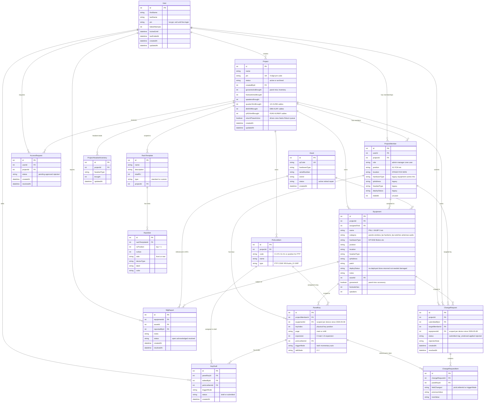
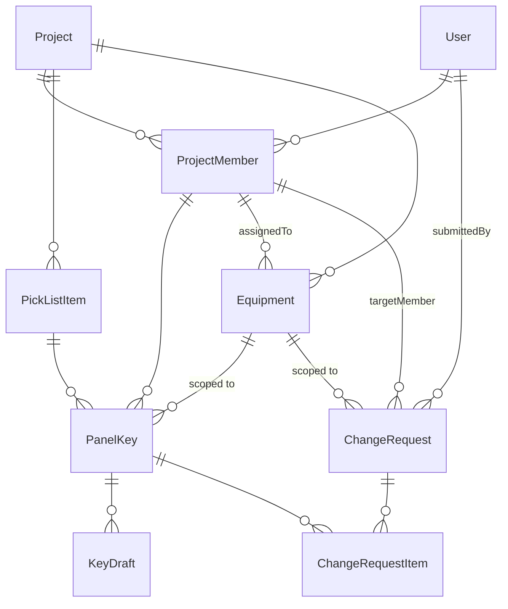

# Nodal Control — Entity Relationship Diagram

**Updated:** 2026-05-08
**Source of truth:** `prisma/schema.prisma`. Regenerate this diagram when the schema changes.

---

## Full ERD

---

## Phase 1 core (active, in-use subset)

The subset of models driven by the UI today:

---

## Unique constraints

| Model | Unique constraint | Enforces |
|---|---|---|
| `Project` | `pin` | No two active projects share a 4-digit join PIN |
| `ProjectMember` | `(userId, projectId)` | A user isn't on the same project twice |
| `PanelKey` | `(equipmentId, keyIndex, page, expansion)` | One physical key position per device — multi-device members get one row per device per slot (changed 2026-05-08; was scoped by `projectMemberId`) |
| `Asset` | `qrCode` | Every physical asset has a unique QR |
| `ProjectHeadsetInventory` | `(projectId, headsetType)` | One brought-total row per headset type per project |

---

## Model groupings

### Phase 1 — Pick List / Panels / Change Requests (in use)

`User`, `Project`, `ProjectHeadsetInventory`, `ProjectMember`, `PickListItem`, `PanelKey`, `KeyDraft`, `ChangeRequest`, `ChangeRequestItem`, `AccessRequest`

### Phase 2-4 — Equipment / Assets / Racks / NFG

`Equipment` (promoted into v2 — Equipment tab drives the app now), `Asset`, `RackTemplate`, `RackSlot`, `NfgReport` (schema present, no UI yet)
