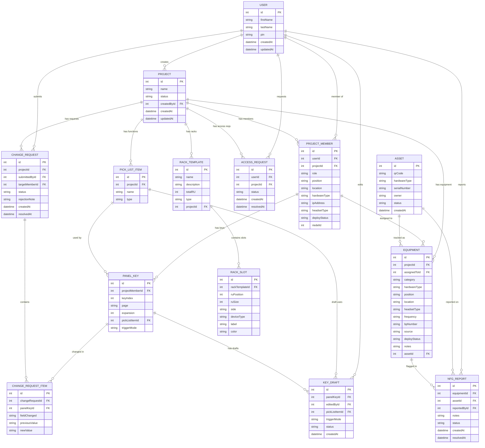

```mermaid
erDiagram
    USER {
        int id PK
        string firstName
        string lastName
        string pin
        datetime createdAt
        datetime updatedAt
    }

    PROJECT {
        int id PK
        string name
        string status
        int createdById FK
        datetime createdAt
        datetime updatedAt
    }

    PROJECT_MEMBER {
        int id PK
        int userId FK
        int projectId FK
        string role
        string position
        string location
        string hardwareType
        string ipAddress
        string headsetType
        string deployStatus
        int riedelId
    }

    PICK_LIST_ITEM {
        int id PK
        int projectId FK
        string name
        string type
    }

    PANEL_KEY {
        int id PK
        int projectMemberId FK
        int keyIndex
        string page
        int expansion
        int pickListItemId FK
        string triggerMode
    }

    KEY_DRAFT {
        int id PK
        int panelKeyId FK
        int editedById FK
        int pickListItemId FK
        string triggerMode
        string status
        datetime createdAt
    }

    CHANGE_REQUEST {
        int id PK
        int projectId FK
        int submittedById FK
        int targetMemberId FK
        string status
        string rejectionNote
        datetime createdAt
        datetime resolvedAt
    }

    CHANGE_REQUEST_ITEM {
        int id PK
        int changeRequestId FK
        int panelKeyId FK
        string fieldChanged
        string previousValue
        string newValue
    }

    ACCESS_REQUEST {
        int id PK
        int userId FK
        int projectId FK
        string status
        datetime createdAt
        datetime resolvedAt
    }

    EQUIPMENT {
        int id PK
        int projectId FK
        int assignedToId FK
        string category
        string hardwareType
        string position
        string location
        string headsetType
        string frequency
        string bpNumber
        string source
        string deployStatus
        string notes
        int assetId FK
    }

    ASSET {
        int id PK
        string qrCode
        string hardwareType
        string serialNumber
        string owner
        string status
        datetime createdAt
    }

    RACK_TEMPLATE {
        int id PK
        string name
        string description
        int totalRU
        string type
        int projectId FK
    }

    RACK_SLOT {
        int id PK
        int rackTemplateId FK
        int ruPosition
        int ruSize
        string side
        string deviceType
        string label
        string color
    }

    NFG_REPORT {
        int id PK
        int equipmentId FK
        int assetId FK
        int reportedById FK
        string notes
        string status
        datetime createdAt
        datetime resolvedAt
    }

    %% ===== RELATIONSHIPS =====

    USER ||--o{ PROJECT : "creates"
    USER ||--o{ PROJECT_MEMBER : "member of"
    USER ||--o{ CHANGE_REQUEST : "submits"
    USER ||--o{ ACCESS_REQUEST : "requests"
    USER ||--o{ KEY_DRAFT : "edits"
    USER ||--o{ NFG_REPORT : "reports"

    PROJECT ||--o{ PROJECT_MEMBER : "has members"
    PROJECT ||--o{ PICK_LIST_ITEM : "has functions"
    PROJECT ||--o{ CHANGE_REQUEST : "has requests"
    PROJECT ||--o{ ACCESS_REQUEST : "has access reqs"
    PROJECT ||--o{ EQUIPMENT : "has equipment"
    PROJECT ||--o{ RACK_TEMPLATE : "has racks"

    PROJECT_MEMBER ||--o{ PANEL_KEY : "has keys"
    PROJECT_MEMBER ||--o{ EQUIPMENT : "assigned to"

    PICK_LIST_ITEM ||--o{ PANEL_KEY : "used by"
    PICK_LIST_ITEM ||--o{ KEY_DRAFT : "draft uses"

    PANEL_KEY ||--o{ KEY_DRAFT : "has drafts"
    PANEL_KEY ||--o{ CHANGE_REQUEST_ITEM : "changed in"

    CHANGE_REQUEST ||--o{ CHANGE_REQUEST_ITEM : "contains"

    RACK_TEMPLATE ||--o{ RACK_SLOT : "contains slots"

    ASSET ||--o{ EQUIPMENT : "tracked as"
    ASSET ||--o{ NFG_REPORT : "reported on"

    EQUIPMENT ||--o{ NFG_REPORT : "flagged in"
```
