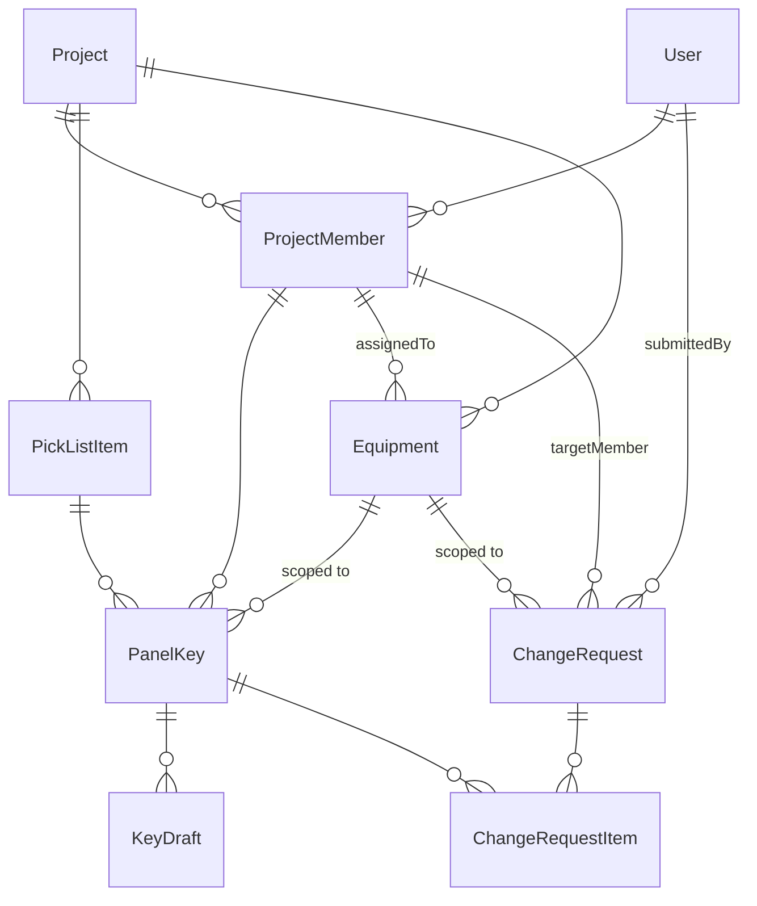
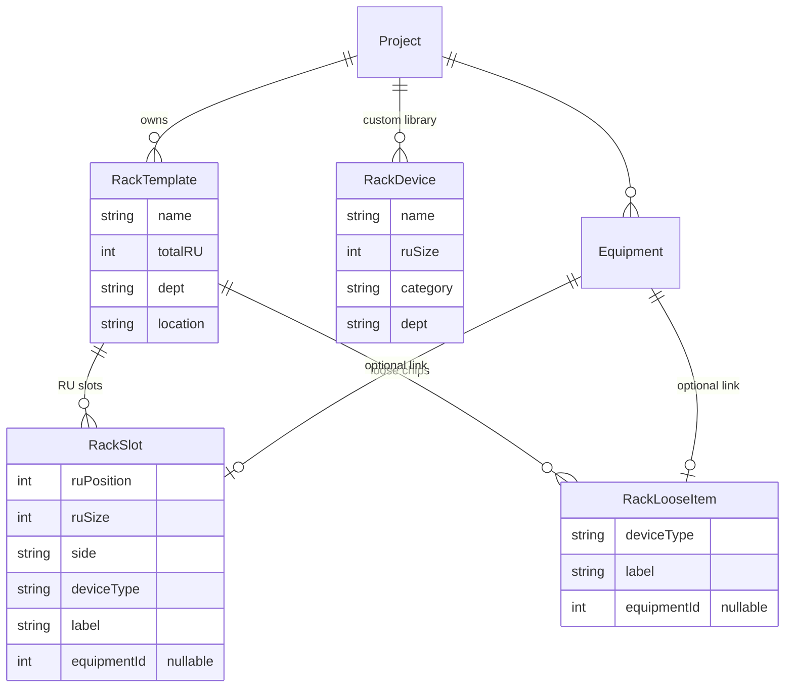
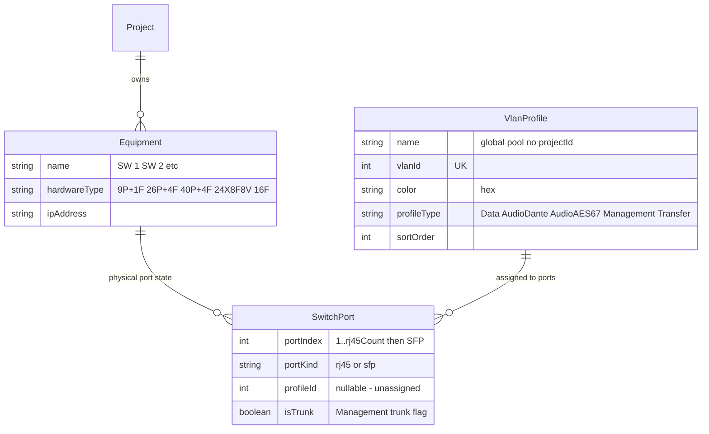

# Nodal Control — Entity Relationship Diagram

**Updated:** 2026-06-08
**Source of truth:** `prisma/schema.prisma`. Regenerate this diagram when the schema changes.

---

## Full ERD

```mermaid
erDiagram
    User ||--o{ Project : "creates"
    User ||--o{ ProjectMember : "has memberships"
    User ||--o{ ChangeRequest : "submits"
    User ||--o{ AccessRequest : "requests"
    User ||--o{ KeyDraft : "edits"
    User ||--o{ NfgReport : "reports"

    Project ||--o{ ProjectMember : "has members"
    Project ||--o{ PickListItem : "owns"
    Project ||--o{ ChangeRequest : "owns"
    Project ||--o{ AccessRequest : "receives"
    Project ||--o{ Equipment : "owns"
    Project ||--o{ RackTemplate : "scoped to"
    Project ||--o{ ProjectHeadsetInventory : "headset totals"
    Project ||--o{ Radio : "owns"
    Project ||--o{ Zone : "owns"
    Project ||--o{ Plot : "owns"

    ProjectMember ||--o{ Radio : "assigned to"
    Zone ||--o{ ZoneChannel : "has channels"
    Zone ||--o{ RadioZone : "tunes radios"
    Radio ||--o{ RadioZone : "tuned to zones"

    User ||--o{ Notification : "receives"
    User ||--o{ NotificationPreference : "configures"
    User ||--o{ PushSubscription : "registers"
    ProjectMember ||--o{ PanelPresence : "presence"

    ProjectMember ||--o{ PanelKey : "has keys"
    ProjectMember ||--o{ Equipment : "assigned to"
    ProjectMember ||--o{ ChangeRequest : "targeted by"
    Equipment ||--o{ PanelKey : "scoped to"
    Equipment ||--o{ ChangeRequest : "scoped to"

    PickListItem ||--o{ PanelKey : "assigned to key"
    PickListItem ||--o{ KeyDraft : "assigned in draft"

    PanelKey ||--o{ KeyDraft : "has drafts"
    PanelKey ||--o{ ChangeRequestItem : "referenced in item"

    ChangeRequest ||--o{ ChangeRequestItem : "contains"

    Asset ||--o{ Equipment : "physical inventory"
    Asset ||--o{ NfgReport : "referenced in NFG"
    Equipment ||--o{ NfgReport : "subject of"

    RackTemplate ||--o{ RackSlot : "has slots"
    RackTemplate ||--o{ RackLooseItem : "has loose items"
    Equipment ||--o{ RackSlot : "linked from"
    Equipment ||--o{ RackLooseItem : "linked from"
    Project ||--o{ RackDevice : "custom library"

    Equipment ||--o{ SwitchPort : "has switch ports"
    VlanProfile ||--o{ SwitchPort : "assigned to ports"

    User {
        int id PK
        string firstName
        string lastName
        string pin "bcrypt, null until first-login"
        int failedAttempts
        datetime lockedUntil
        datetime lastFailedAt
        datetime createdAt
        datetime updatedAt
    }

    Project {
        int id PK
        string name
        string pin UK "4-digit join code"
        string status "active or archived"
        int createdById FK
        int goosenecksBrought "panel misc inventory"
        int footswitchesBrought
        int speakersBrought
        int quarterXlrmBrought "1/4-XLRM cables"
        int db9XlrfBrought "DB9-XLRF cables"
        int rj45XlrmfBrought "RJ45-XLRM/F cables"
        boolean returnPhaseActive "drives crew /tasks Return queue"
        datetime createdAt
        datetime updatedAt
    }

    ProjectHeadsetInventory {
        int id PK
        int projectId FK
        string headsetType
        int brought
        datetime updatedAt
    }

    ProjectMember {
        int id PK
        int userId FK
        int projectId FK
        string role "admin manager crew user"
        string position "A1 FOH etc"
        string location "STAGE FOH MON"
        string hardwareType "legacy equipment carries this"
        string ipAddress "legacy"
        string headsetType "legacy"
        string deployStatus "legacy"
        int riedelId "unused"
    }

    PickListItem {
        int id PK
        int projectId FK
        string code "C1 IF1 G1 A1 or position for PTP"
        string name
        string type "PTP CONF IFB Audio_IO GRP"
    }

    PanelKey {
        int id PK
        int projectMemberId FK
        int equipmentId FK "scoped per device since 2026-05-08"
        int keyIndex "physical key position"
        string page "main or shift"
        int expansion "0 main 1-6 expansion"
        int pickListItemId FK
        string triggerMode "latch momentary auto"
        string talkMode "tl t l"
    }

    KeyDraft {
        int id PK
        int panelKeyId FK
        int editedById FK
        int pickListItemId FK
        string triggerMode
        string status "draft or submitted"
        datetime createdAt
    }

    ChangeRequest {
        int id PK
        int projectId FK
        int submittedById FK
        int targetMemberId FK
        int equipmentId FK "scoped per device since 2026-05-08"
        string status "submitted mgr_endorsed applied rejected"
        string rejectionNote
        datetime createdAt
        datetime resolvedAt
    }

    ChangeRequestItem {
        int id PK
        int changeRequestId FK
        int panelKeyId FK
        string fieldChanged "pickListItemId or triggerMode"
        string previousValue
        string newValue
    }

    AccessRequest {
        int id PK
        int userId FK
        int projectId FK
        string status "pending approved rejected"
        datetime createdAt
        datetime resolvedAt
    }

    Equipment {
        int id PK
        int projectId FK
        int assignedToId FK
        string name "PNL 1 WLBP 3 etc"
        string category "panels wireless_bp hardwire_bp switches antennas audio"
        string hardwareType "KP-5032 Bolero etc"
        string position
        string location
        string headsetType
        string ipAddress
        string patch
        string deployStatus "na deployed done returned not-needed damaged"
        string notes
        int assetId FK
        boolean gooseneck "panel misc accessory"
        int footswitches
        int speakers
    }

    Asset {
        int id PK
        string qrCode UK
        string hardwareType
        string serialNumber
        string owner
        string status "active retired repair"
        datetime createdAt
    }

    RackTemplate {
        int id PK
        string name
        string description
        int totalRU "17, 32, 40, varies by show"
        string type "standard or custom"
        string dept "comms or radios"
        string location "FOH, MON, STAGE, Studio A, Truck 1"
        int projectId FK "nullable for global templates"
    }

    RackSlot {
        int id PK
        int rackTemplateId FK
        int ruPosition "top = 1"
        int ruSize "1+, used for slot height"
        string side "front or rear"
        string deviceType "preset name or custom"
        string label "free-form or eq.name"
        string color
        int equipmentId FK "optional Equipment link, switches+audio"
    }

    RackLooseItem {
        int id PK
        int rackTemplateId FK
        string deviceType "Antaira, Intellanet, Bolero AM, etc"
        string label "optional"
        int equipmentId FK "optional Equipment link"
    }

    RackDevice {
        int id PK
        string name "displayed in library"
        int ruSize "0 = loose, otherwise 1+"
        string category "frames twoWire ptp switches audio patchbay panels drawers power loose"
        string dept "comms or radios"
        int projectId FK "nullable for global library"
    }

    NfgReport {
        int id PK
        int equipmentId FK
        int assetId FK
        int reportedById FK
        string notes
        string status "open acknowledged resolved"
        datetime createdAt
        datetime resolvedAt
    }

    Radio {
        int id PK
        int projectId FK
        int assignedToId FK "nullable ProjectMember"
        string radioId "user-facing ID e.g. R1"
        string barcode UK "scanned barcode"
        string model
        string status "na out returned damaged lost"
        datetime createdAt
        datetime updatedAt
    }

    Zone {
        int id PK
        int projectId FK
        string name
        int sortOrder
    }

    ZoneChannel {
        int id PK
        int zoneId FK
        int channelIndex
        string label
        string color
    }

    RadioZone {
        int id PK
        int radioId FK
        int zoneId FK
    }

    Plot {
        int id PK
        int projectId FK
        string name
        string svgUrl
    }

    Notification {
        int id PK
        int userId FK
        string kind "task tag deploy etc"
        string title
        string body
        boolean read
        datetime createdAt
    }

    NotificationPreference {
        int id PK
        int userId FK
        string channel "push email"
        string kind
        boolean enabled
    }

    PushSubscription {
        int id PK
        int userId FK
        string endpoint UK
        string p256dh
        string auth
        datetime createdAt
    }

    PanelPresence {
        int id PK
        int projectMemberId FK
        int equipmentId FK
        datetime seenAt
    }

    VlanProfile {
        int id PK
        string name "CommsDante1 AES67_1 Management VPN_Transfer etc"
        int vlanId UK "1331 1341 4000 etc"
        string color "hex e.g. #3174c2"
        string profileType "Data AudioDante AudioAES67 Management Transfer"
        string description "optional"
        int sortOrder "stable display order in picker"
    }

    SwitchPort {
        int id PK
        int equipmentId FK
        int portIndex "1-based, RJ45 then SFP"
        string portKind "rj45 or sfp"
        int profileId FK "optional VlanProfile link"
        boolean isTrunk "independent of profileId"
    }
```

---

## Phase 1 core (active, in-use subset)

The subset of models driven by the UI today:

### Rack designer subset (v2.4)

### Switch Studio subset (v2.5)

VlanProfile is **global** (no `projectId`) — one pool of company-wide VLAN definitions. SwitchPort is per-Equipment (per physical switch). Lazy seeding on first Switch Studio open populates `SwitchPort` rows from the model's `defaultFor()` table (see `src/lib/switch-models.ts`).

---

## Unique constraints

| Model | Unique constraint | Enforces |
|---|---|---|
| `Project` | `pin` | No two active projects share a 4-digit join PIN |
| `ProjectMember` | `(userId, projectId)` | A user isn't on the same project twice |
| `PanelKey` | `(equipmentId, keyIndex, page, expansion)` | One physical key position per device — multi-device members get one row per device per slot (changed 2026-05-08; was scoped by `projectMemberId`) |
| `Asset` | `qrCode` | Every physical asset has a unique QR |
| `ProjectHeadsetInventory` | `(projectId, headsetType)` | One brought-total row per headset type per project |
| `Radio` | `(projectId, radioId)`, `barcode` | No duplicate user-facing IDs per project; barcodes are globally unique |
| `RadioZone` | `(radioId, zoneId)` | A radio is tuned to a given zone at most once |
| `Zone` | `(projectId, name)` | Zone names are unique within a project |
| `PushSubscription` | `endpoint` | One subscription record per browser endpoint |
| `RackSlot` | `(rackTemplateId, side, ruPosition)` (logical, enforced in code) | One slot per RU starting-position per side. Collision detection in the drag pipeline checks every RU the slot would span, not just `ruPosition`. |
| `VlanProfile` | `vlanId` | No two profiles share a VLAN ID (1331, 1341, 4000, …). Names + colors can repeat across types but the numeric ID is unique. |
| `SwitchPort` | `(equipmentId, portIndex)` | One row per physical port per switch. Lazy-seeded on first Switch Studio open. |

---

## Model groupings

### Phase 1 — Pick List / Panels / Change Requests (in use)

`User`, `Project`, `ProjectHeadsetInventory`, `ProjectMember`, `PickListItem`, `PanelKey`, `KeyDraft`, `ChangeRequest`, `ChangeRequestItem`, `AccessRequest`

### Phase 2-4 — Equipment / Assets / Racks / NFG

| Model | Status |
|---|---|
| `Equipment` | **In use** (promoted into v2 — Equipment tab drives the app now) |
| `RackTemplate` | **In use (v2.4)** — Racks tab + RackStudio + Preview |
| `RackSlot` | **In use (v2.4)** — one slot per RU starting-position per face; optional `equipmentId` |
| `RackLooseItem` | **In use (v2.4)** — non-RU devices tagged to a rack (chips above the chassis) |
| `RackDevice` | **In use (v2.4)** — user-authored custom devices for the library |
| `VlanProfile` | **In use (v2.5)** — global VLAN pool, seeded from the company hex chart, shared by every project's switches |
| `SwitchPort` | **In use (v2.5)** — per-Equipment port state, lazy-seeded on first Switch Studio open |
| `Asset` | Schema present, no UI |
| `NfgReport` | Schema present, no UI |
| `MultStrand` | Schema present (Phase 4), no UI |
