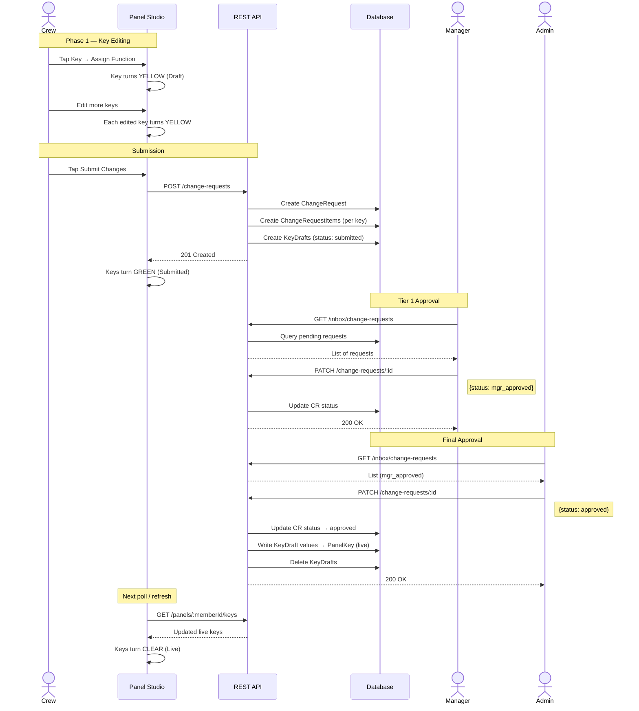
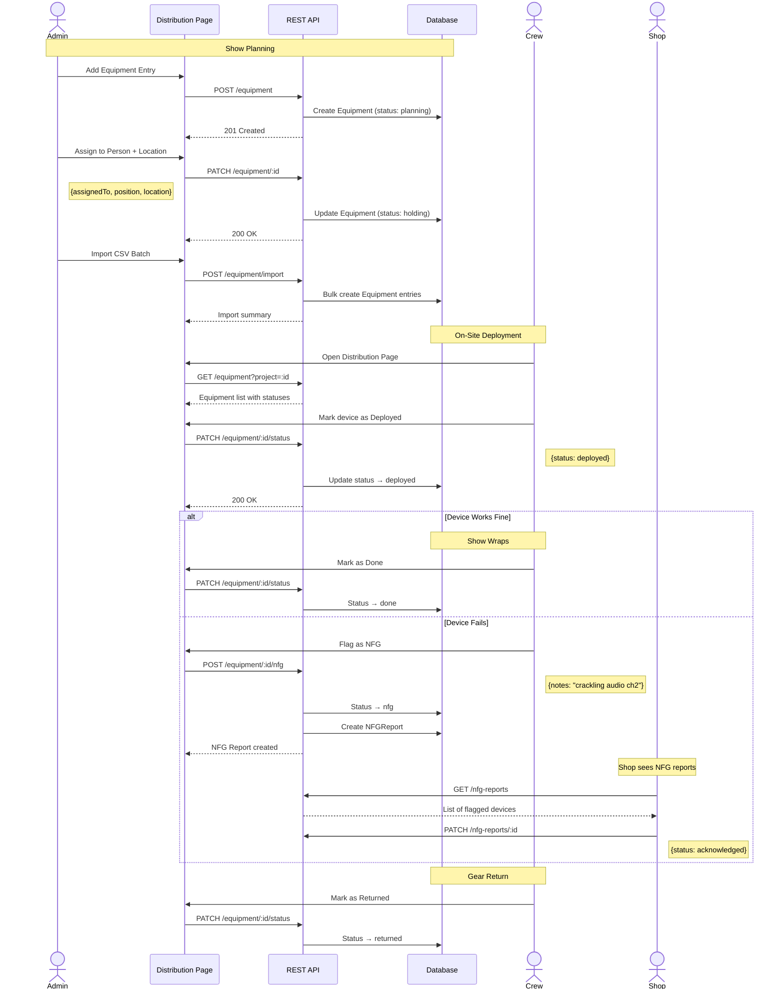
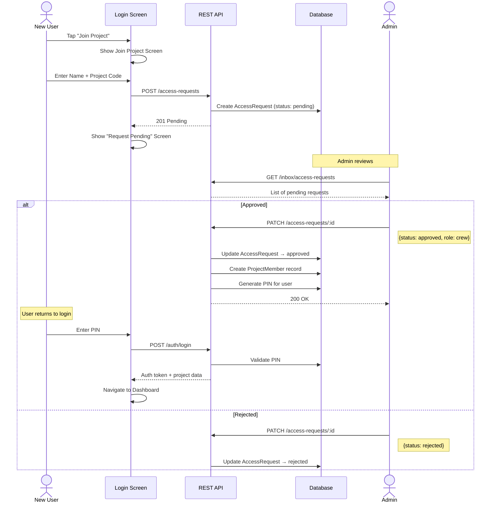

## Change Request Flow

```mermaid
sequenceDiagram
    actor Crew
    participant UI as Panel Studio
    participant API as REST API
    participant DB as Database
    actor Manager
    actor Admin

    Note over Crew,UI: Phase 1 — Key Editing
    Crew->>UI: Tap Key → Assign Function
    UI->>UI: Key turns YELLOW (Draft)
    Crew->>UI: Edit more keys
    UI->>UI: Each edited key turns YELLOW

    Note over Crew,API: Submission
    Crew->>UI: Tap Submit Changes
    UI->>API: POST /change-requests
    API->>DB: Create ChangeRequest
    API->>DB: Create ChangeRequestItems (per key)
    API->>DB: Create KeyDrafts (status: submitted)
    API-->>UI: 201 Created
    UI->>UI: Keys turn GREEN (Submitted)

    Note over Manager,DB: Tier 1 Approval
    Manager->>API: GET /inbox/change-requests
    API->>DB: Query pending requests
    API-->>Manager: List of requests
    Manager->>API: PATCH /change-requests/:id
    Note right of Manager: {status: mgr_approved}
    API->>DB: Update CR status
    API-->>Manager: 200 OK

    Note over Admin,DB: Final Approval
    Admin->>API: GET /inbox/change-requests
    API-->>Admin: List (mgr_approved)
    Admin->>API: PATCH /change-requests/:id
    Note right of Admin: {status: approved}
    API->>DB: Update CR status → approved
    API->>DB: Write KeyDraft values → PanelKey (live)
    API->>DB: Delete KeyDrafts
    API-->>Admin: 200 OK

    Note over UI: Next poll / refresh
    UI->>API: GET /panels/:memberId/keys
    API-->>UI: Updated live keys
    UI->>UI: Keys turn CLEAR (Live)
```

---

## Equipment Deployment Flow

```mermaid
sequenceDiagram
    actor Admin
    participant Dist as Distribution Page
    participant API as REST API
    participant DB as Database
    actor Crew
    actor Shop

    Note over Admin,DB: Show Planning
    Admin->>Dist: Add Equipment Entry
    Dist->>API: POST /equipment
    API->>DB: Create Equipment (status: planning)
    API-->>Dist: 201 Created

    Admin->>Dist: Assign to Person + Location
    Dist->>API: PATCH /equipment/:id
    Note right of Admin: {assignedTo, position, location}
    API->>DB: Update Equipment (status: holding)
    API-->>Dist: 200 OK

    Admin->>Dist: Import CSV Batch
    Dist->>API: POST /equipment/import
    API->>DB: Bulk create Equipment entries
    API-->>Dist: Import summary

    Note over Crew,DB: On-Site Deployment
    Crew->>Dist: Open Distribution Page
    Dist->>API: GET /equipment?project=:id
    API-->>Dist: Equipment list with statuses

    Crew->>Dist: Mark device as Deployed
    Dist->>API: PATCH /equipment/:id/status
    Note right of Crew: {status: deployed}
    API->>DB: Update status → deployed
    API-->>Dist: 200 OK

    alt Device Works Fine
        Note over Crew,DB: Show Wraps
        Crew->>Dist: Mark as Done
        Dist->>API: PATCH /equipment/:id/status
        API->>DB: Status → done
    else Device Fails
        Crew->>Dist: Flag as NFG
        Dist->>API: POST /equipment/:id/nfg
        Note right of Crew: {notes: "crackling audio ch2"}
        API->>DB: Status → nfg
        API->>DB: Create NFGReport
        API-->>Dist: NFG Report created

        Note over Shop: Shop sees NFG reports
        Shop->>API: GET /nfg-reports
        API-->>Shop: List of flagged devices
        Shop->>API: PATCH /nfg-reports/:id
        Note right of Shop: {status: acknowledged}
    end

    Note over Crew,DB: Gear Return
    Crew->>Dist: Mark as Returned
    Dist->>API: PATCH /equipment/:id/status
    API->>DB: Status → returned
```

---

## Join Project + Access Request Flow

```mermaid
sequenceDiagram
    actor NewUser as New User
    participant Login as Login Screen
    participant API as REST API
    participant DB as Database
    actor Admin

    NewUser->>Login: Tap "Join Project"
    Login->>Login: Show Join Project Screen
    NewUser->>Login: Enter Name + Project Code
    Login->>API: POST /access-requests
    API->>DB: Create AccessRequest (status: pending)
    API-->>Login: 201 Pending
    Login->>Login: Show "Request Pending" Screen

    Note over Admin,DB: Admin reviews
    Admin->>API: GET /inbox/access-requests
    API-->>Admin: List of pending requests

    alt Approved
        Admin->>API: PATCH /access-requests/:id
        Note right of Admin: {status: approved, role: crew}
        API->>DB: Update AccessRequest → approved
        API->>DB: Create ProjectMember record
        API->>DB: Generate PIN for user
        API-->>Admin: 200 OK

        Note over NewUser: User returns to login
        NewUser->>Login: Enter PIN
        Login->>API: POST /auth/login
        API->>DB: Validate PIN
        API-->>Login: Auth token + project data
        Login->>Login: Navigate to Dashboard
    else Rejected
        Admin->>API: PATCH /access-requests/:id
        Note right of Admin: {status: rejected}
        API->>DB: Update AccessRequest → rejected
    end
```
