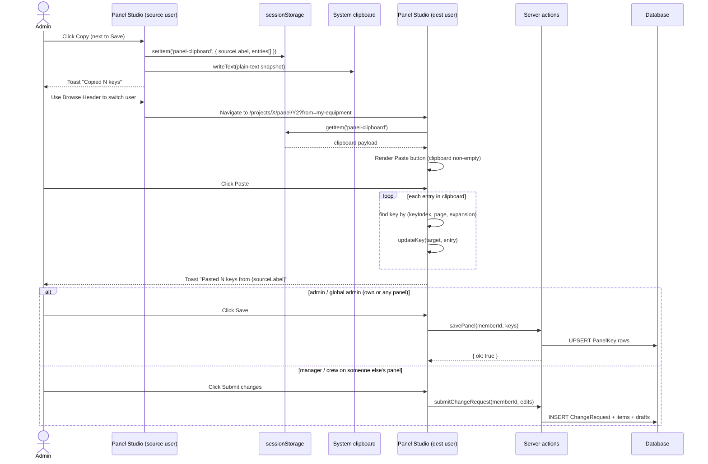
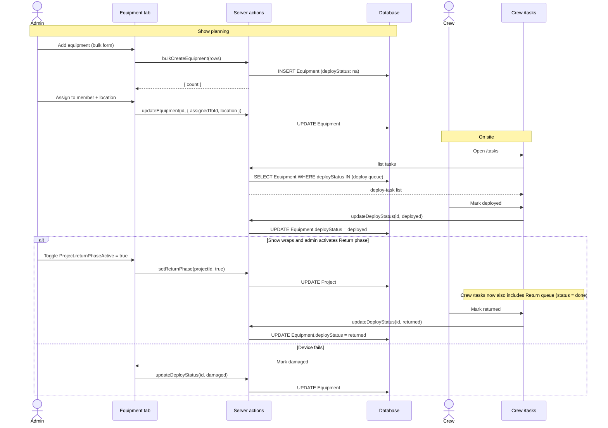
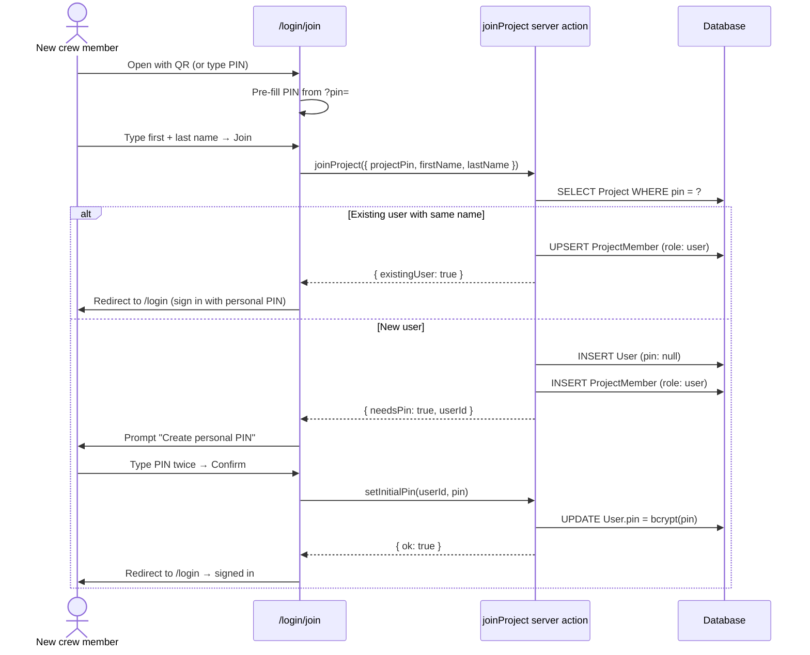
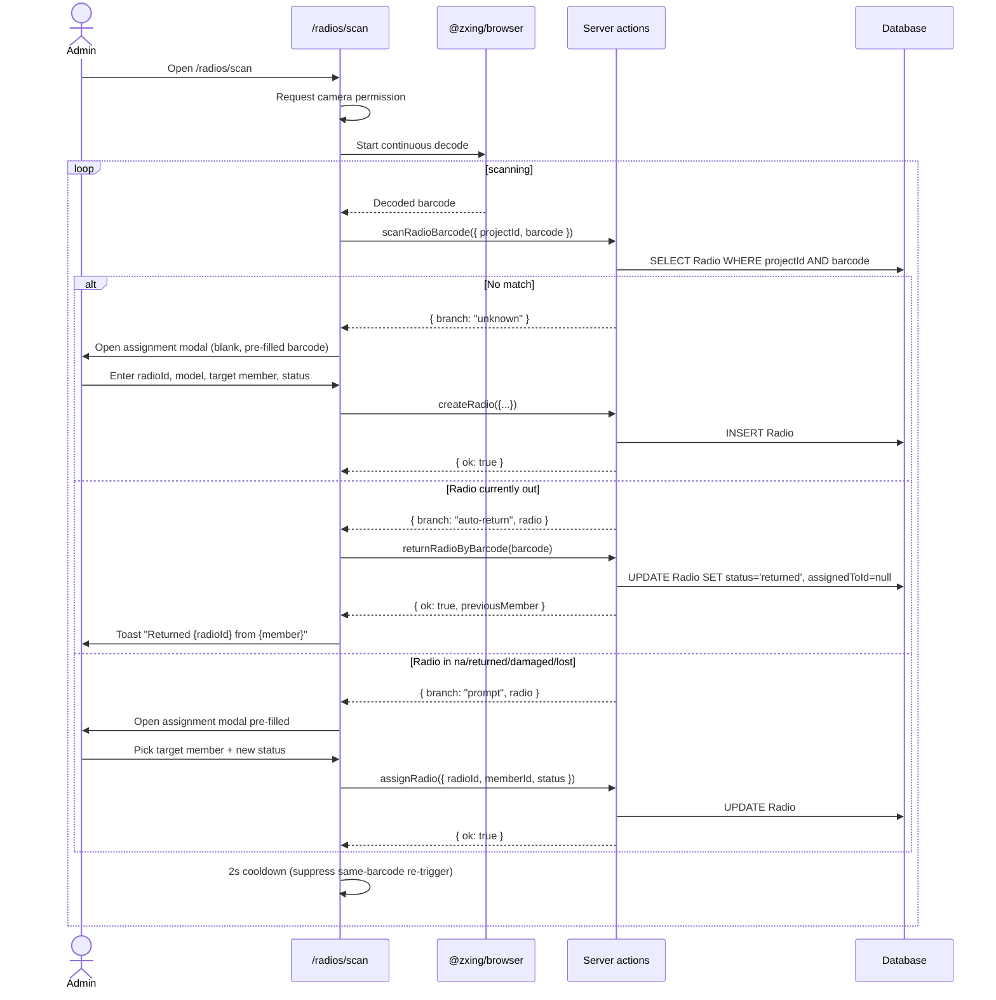
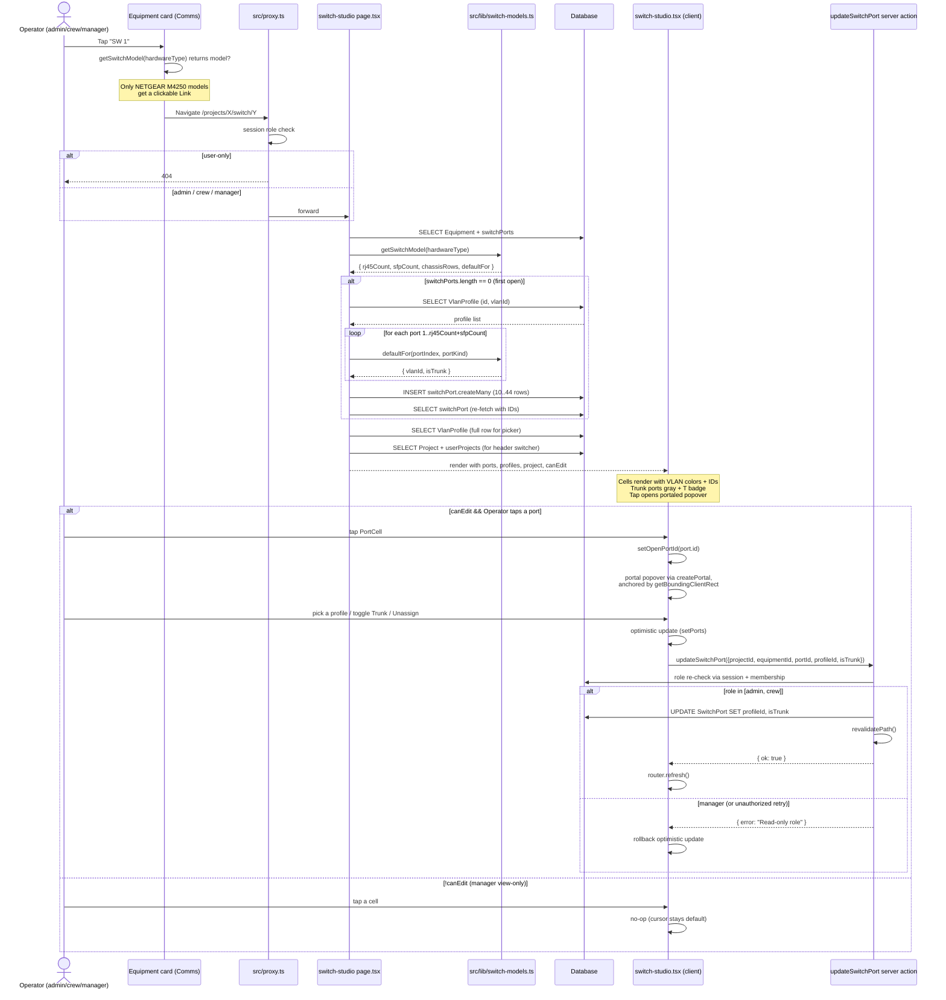

# Nodal Control — Sequence Diagrams

**Updated:** 2026-06-08

## Change Request Flow (current implementation)

The crew submits, the admin reviews directly. There is no separate manager approval step in code today — manager endorsement is a CR status (`mgr_endorsed`) but the admin is still the final and only resolver. Communication is server actions + 5-second polling, not a REST PATCH endpoint.

```mermaid
sequenceDiagram
    actor Crew
    participant UI as Panel Studio (crew)
    participant SA as Server actions
    participant DB as Database
    actor Admin
    participant AdminUI as Tasks / Panel Studio (review)

    Note over Crew,UI: Phase 1 — Key Editing
    Crew->>UI: Tap key → pick item from picker
    UI->>UI: Key turns YELLOW (changed)
    Crew->>UI: Edit more keys

    Note over Crew,DB: Submission
    Crew->>UI: Tap Submit changes
    UI->>SA: submitChangeRequest(panelId, edits)
    SA->>DB: INSERT ChangeRequest (status: submitted)
    SA->>DB: INSERT ChangeRequestItem rows (per key)
    SA->>DB: INSERT KeyDraft rows (status: submitted)
    SA-->>UI: { ok: true }
    UI->>UI: Keys turn GREEN (submitted)

    Note over UI,SA: Polling — both sides
    loop every 5s while submitted
        UI->>SA: router.refresh()
        SA->>DB: SELECT PanelKey, recentResolutions
        SA-->>UI: page data
        UI->>UI: compute fingerprint; no change → skip
    end

    Note over Admin,AdminUI: Resolution
    AdminUI->>SA: GET /api/admin/task-count (5s poll)
    SA-->>AdminUI: { count: N }
    AdminUI->>AdminUI: Tasks badge = N
    Admin->>AdminUI: Click Tasks → Review
    AdminUI->>AdminUI: Navigate /projects/X/panel/Y?review=MID
    Admin->>AdminUI: Per-key toggle Approve / Deny
    Admin->>SA: resolveChangeRequests(crIds, approvedKeys)
    SA->>DB: UPDATE PanelKey for approved items
    SA->>DB: UPDATE ChangeRequest.status = applied or rejected
    SA->>DB: DELETE KeyDraft(submitted) rows
    SA-->>AdminUI: { ok: true }
    AdminUI->>AdminUI: router.replace /admin

    Note over UI: Crew picks up next poll
    UI->>SA: router.refresh()
    SA-->>UI: PanelKey + recentResolutions
    UI->>UI: fingerprint changed → setKeys(initializeKeys(...))
    UI->>UI: For each resolution item:<br/>currentPanelKey == newValue ⇒ approved<br/>else ⇒ denied
    UI->>UI: Toast: "Your panel changes are live" (approved)
    UI->>UI: Toast: "Keys X, Y denied" (denied)
```

---

## Panel Copy / Paste between users



---

## Equipment Deployment Flow



---

## Join Project (current behavior)

The original AccessRequest gating step is not used. The project PIN is the gate — anyone with it joins immediately, then sets a personal PIN.



---

## Radio Barcode Scan

Admins and managers use `/radios/scan` to triage radios with the device
camera. The scanner runs a continuous `@zxing/browser` decode loop and
branches on the current `Radio.status` for the scanned barcode within
the active project.



---

## Switch Studio — open + lazy-seed + port edit (v2.5)

The page loader handles three things in one server request: role gate
(404 for user), lazy-seed of SwitchPort rows on first open, and fetch
of everything the client needs. The client then becomes interactive
without further round-trips until an edit.



Notes:
- The lazy-seed branch only fires on the FIRST open of a specific
  switch. The data is durable from then on — every subsequent visit
  skips the seed entirely.
- `VlanProfile` IDs are resolved by `vlanId` during the seed pass, so
  renames or color tweaks to the global VLAN pool don't break the
  seed math (the numeric ID is the stable handle).
- Trunk ports preserve their underlying `profileId` so the operator
  can flip Trunk on/off without losing the VLAN assignment.
- Manager role is rejected by the server action even if they manage
  to call it (e.g. via dev tools) — proxy gate + server gate.
