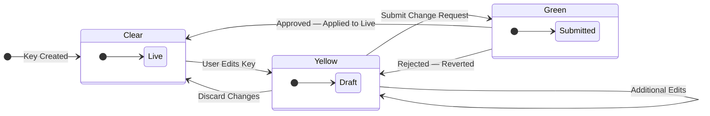
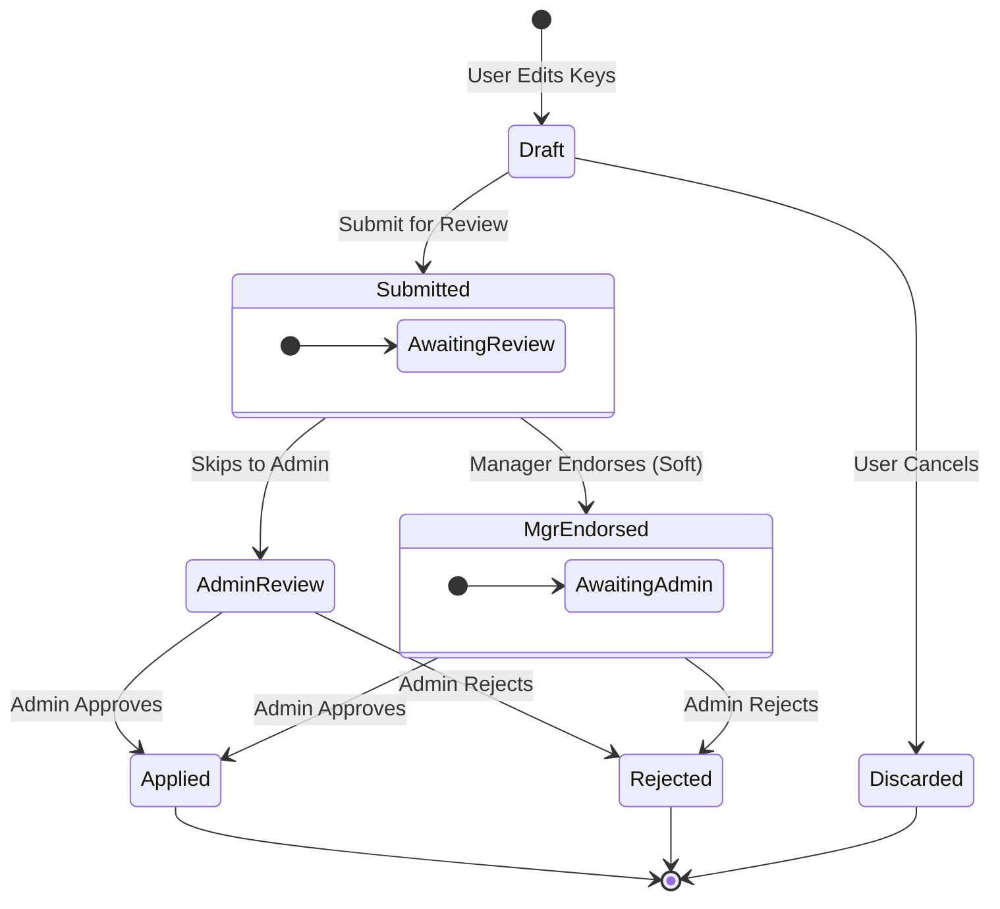
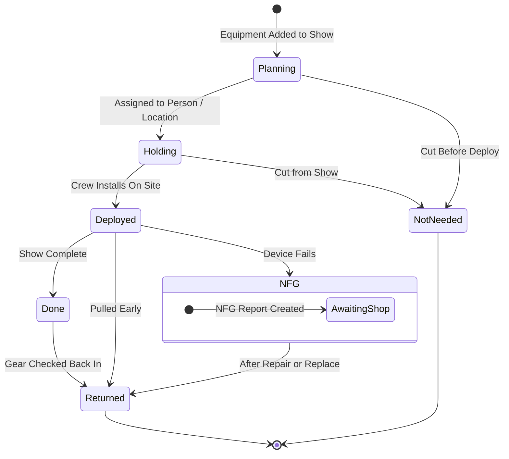

## Key State Lifecycle

```mermaid
stateDiagram-v2
    direction LR

    [*] --> Clear : Key Created

    Clear --> Yellow : User Edits Key
    Yellow --> Yellow : Additional Edits
    Yellow --> Clear : Discard Changes
    Yellow --> Green : Submit Change Request

    Green --> Clear : Approved — Applied to Live
    Green --> Yellow : Rejected — Reverted

    state Clear {
        direction LR
        [*] --> Live
    }

    state Yellow {
        direction LR
        [*] --> Draft
    }

    state Green {
        direction LR
        [*] --> Submitted
    }
```

---

## Change Request Lifecycle

```mermaid
stateDiagram-v2
    direction TB

    [*] --> Draft : User Edits Keys

    Draft --> Submitted : Submit for Review
    Draft --> Discarded : User Cancels

    Submitted --> MgrEndorsed : Manager Endorses (Soft)
    Submitted --> AdminReview : Skips to Admin

    MgrEndorsed --> Applied : Admin Approves
    MgrEndorsed --> Rejected : Admin Rejects

    AdminReview --> Applied : Admin Approves
    AdminReview --> Rejected : Admin Rejects

    Applied --> [*]
    Rejected --> [*]
    Discarded --> [*]

    state Submitted {
        direction LR
        [*] --> AwaitingReview
    }

    state MgrEndorsed {
        direction LR
        [*] --> AwaitingAdmin
    }
```

---

## Equipment Deploy Status Lifecycle

```mermaid
stateDiagram-v2
    direction TB

    [*] --> Planning : Equipment Added to Show

    Planning --> Holding : Assigned to Person / Location
    Planning --> NotNeeded : Cut Before Deploy

    Holding --> Deployed : Crew Installs On Site
    Holding --> NotNeeded : Cut from Show

    Deployed --> Done : Show Complete
    Deployed --> Returned : Pulled Early
    Deployed --> NFG : Device Fails

    NFG --> Returned : After Repair or Replace

    Done --> Returned : Gear Checked Back In

    Returned --> [*]
    NotNeeded --> [*]

    state NFG {
        direction LR
        [*] --> AwaitingShop : NFG Report Created
    }
```
