# Nodal Control — State Diagrams

**Updated:** 2026-06-08

Describes the state machines driving the app's key workflows: panel-key editing, change-request resolution, and equipment deploy status. The **Panel key** states below are the client-side visual states used in Panel Studio; the actual DB model is `PanelKey` + `KeyDraft`.

---

## 1. Panel Key (client-side visual state)

Each key on a panel has a single visual state in the UI. The state transitions are driven by user action + server fingerprint sync.

Note on denial: on the **crew's** client, when polling detects the denial (via `recentResolutions`), `initializeKeys` resets state to server truth (which is the pre-change value). The crew sees their previous assigned value come back + an error toast naming the denied keys.

---

## 2. ChangeRequest Lifecycle (server-side)

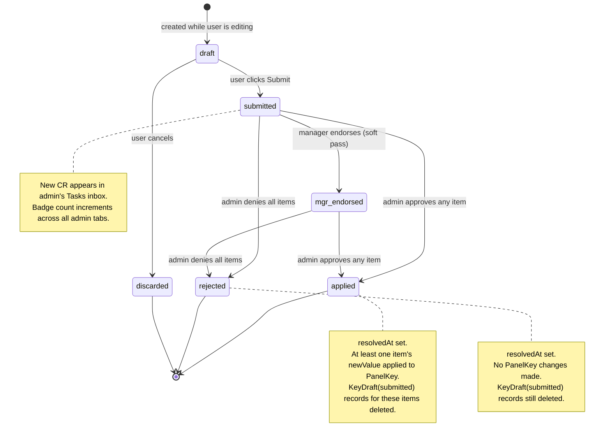

Status column values in `ChangeRequest.status`: `draft`, `submitted`, `mgr_endorsed`, `applied`, `rejected`, `discarded`. Schema also defines `approved` but the current `resolveChangeRequests` action skips straight to `applied` (no intermediate approved-waiting-to-apply state).

---

## 3. Equipment Deploy Status

Status values live in `src/lib/deploy-status.ts`. Transitions are not enforced by the server — any allowed role (admin, crew) can change to any value directly via the Listbox dropdown. This diagram is the **expected** operational flow.

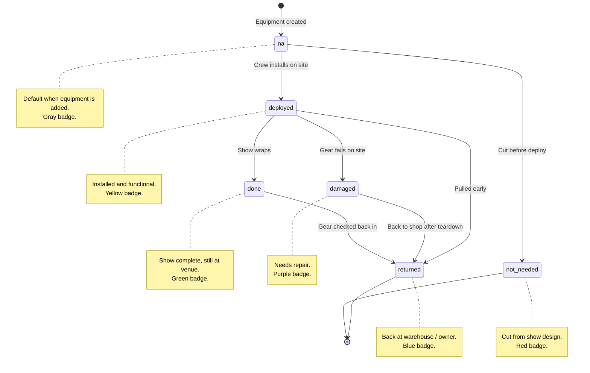

When `Project.returnPhaseActive` is true, crew see `done` gear surfaced as Return tasks in `/tasks` alongside the existing Deploy tasks (anything still `na`). The status field itself is unchanged — the toggle just decides which states the task list pulls.

---

## 4. User First-Login Status

Drives the Team-tab "Active / Pending" indicator. Not a stored enum — derived from `User.pin` being null or not.

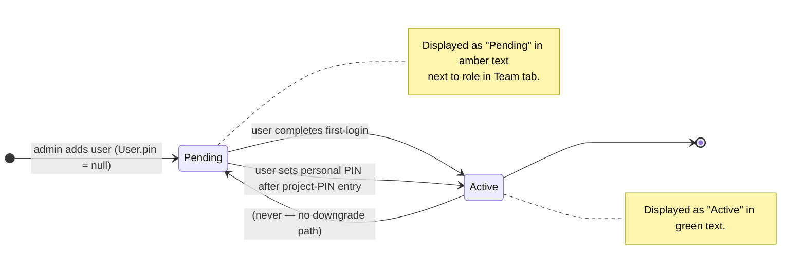

---

## 5. Account Lockout

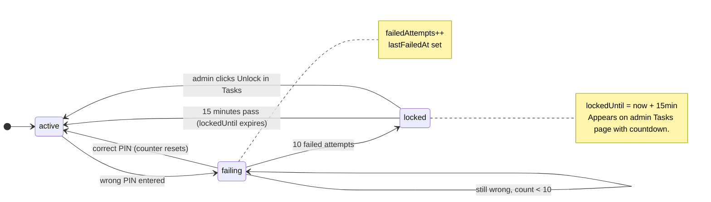

---

## 6. Radio Status

Status values live in `src/lib/radio-status.ts`. Every radio is created
with status `na` and moves through the dropdown on the Radios → Radio
Equipment tab, the scanner-page modal, or `returnRadioByBarcode` (the
auto-return branch). Transitions are not enforced server-side — admins
can override directly. This diagram is the expected operational flow.

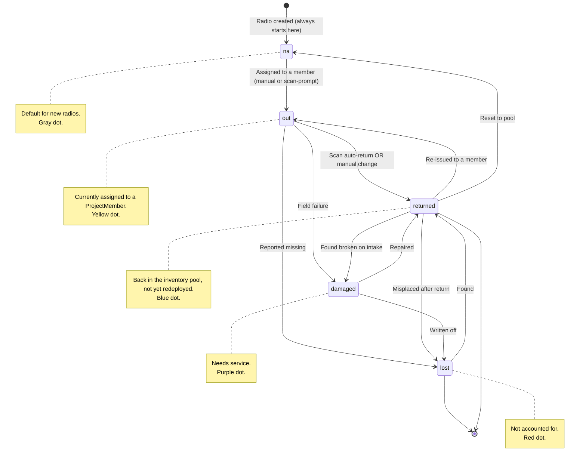

The scanner page branches based on the current status when a barcode is
recognized: a radio in `out` status triggers a silent
`returnRadioByBarcode` call; any other status (including `na`,
`returned`, `damaged`, `lost`) opens the assignment modal pre-filled,
letting the admin pick a target member + status manually.

---

## 5a. Panel Studio session mode

Same route (`/projects/[id]/panel/[equipmentId]`) renders in different modes depending on who is viewing, who the panel belongs to, and how the operator arrived. Mode determines whether save is direct (admin) vs change-request (everyone else), whether Copy/Paste appears, whether the Browse Header sits above the chassis, and whether per-key Approve/Deny toggles render.

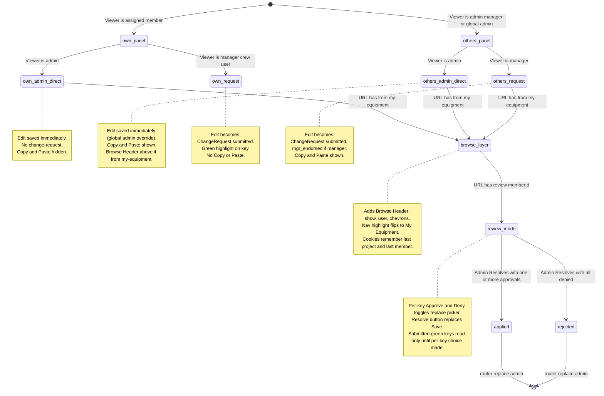

**Mode-determining inputs:**

| Input | Source |
|---|---|
| Is panel mine? | `equipment.assignedToId === session.member.id` |
| Am I admin? | `session.memberships.some(m => m.role === 'admin')` (global) OR `currentMembership.role === 'admin'` |
| Am I manager on this project? | `currentMembership.role === 'manager'` |
| Browse mode? | URL `?from=my-equipment` is present |
| Review mode? | URL `?review={memberId}` is present (only admin gets the route here from Tasks) |

---

## 6a. RackSlot lifecycle (Rack Studio, v2.4)

The slot moves through a small state machine driven by drag-and-tap operator actions. Library tiles + chassis rows act together as the placement target. A slot can be linked to an `Equipment` row (`equipmentId IS NOT NULL`) or stand-alone — the link is set at creation and can be swapped via the slot's edit form but the slot itself stays the same row.

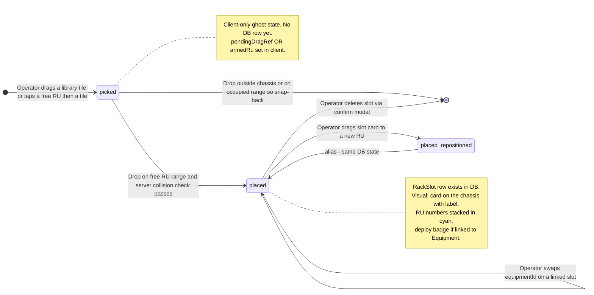

**Linked vs unlinked variants:**

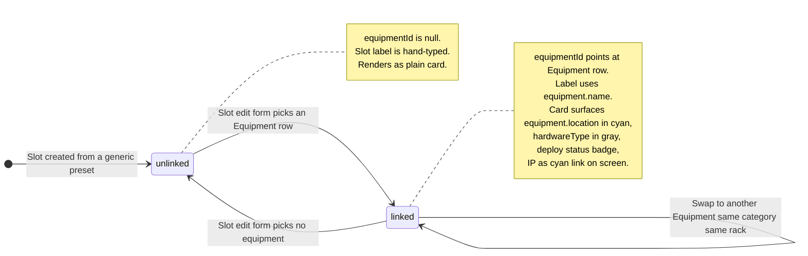

---

## 6b. RackTemplate department (Rack Studio, v2.4)

`RackTemplate.dept` decides which side of the company the rack belongs to — affects library default category filter, which presets show up, and where the rack is grouped on the Racks tab.

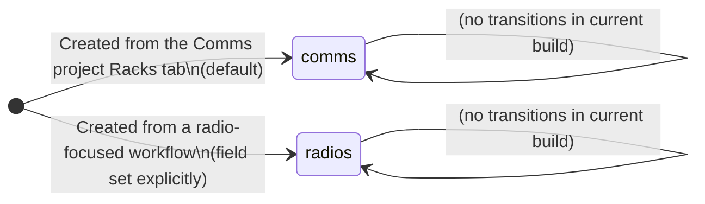

Today the Racks tab is only Comms-scoped — `radios` dept is reserved for the future Radio rack designer. No UI to flip dept after creation; if you need to move a rack, delete + recreate.

---

## 7. SwitchPort visual state (Switch Studio, v2.5)

Each port on a switch's chassis has one of three visual states. Plus
an orthogonal **Trunk** flag that overrides the cell color (gray +
T badge) while preserving the underlying profile assignment.

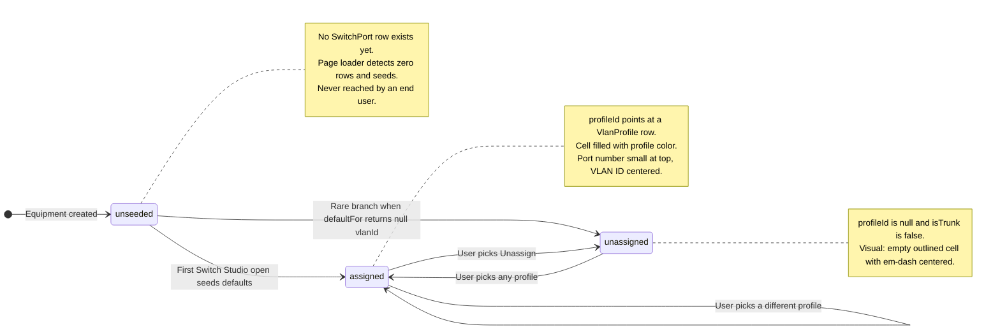

### Trunk flag (orthogonal)

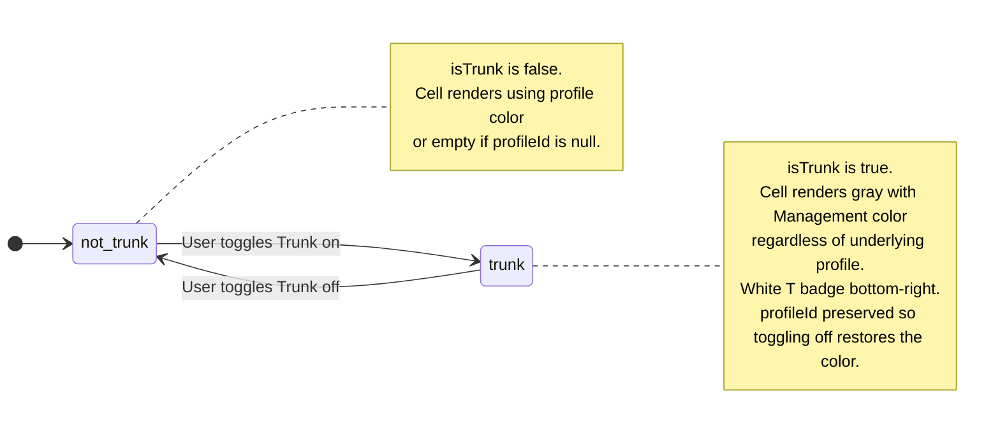

**Why orthogonal:** A trunk port still has a "primary" VLAN at the
hardware layer — the operator wants to see what that is when planning,
but the chassis at-a-glance reads better when every trunk is uniformly
gray (matches NETGEAR ProAV Engage's UI). Toggling Trunk off restores
the colored fill without re-picking the profile.

**Default seed conventions** (see PD-031 and `src/lib/switch-models.ts`):

| Model | RJ45 1..rj45Count default | SFP default |
|---|---|---|
| 9P+1F | 1–4 CommsDante1, 5–8 AES67_1, 9 Mgmt trunk | 1 SFP Mgmt trunk |
| 26P+4F | 1–12 CommsDante1, 13–24 AES67_1, 25–26 Mgmt trunk | 4 SFP Mgmt trunk |
| 40P+4F | 1–20 CommsDante1, 21–40 AES67_1 | 4 SFP Mgmt trunk |
| 24X8F8V | 1–12 CommsDante1, 13–24 AES67_1 | 16 SFP Mgmt trunk |
| 16F | (no RJ45) | 16 SFP Mgmt trunk |
