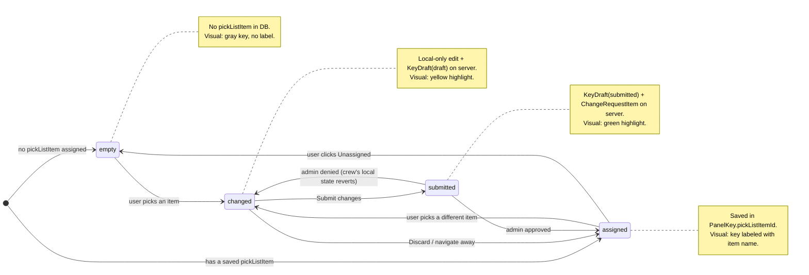
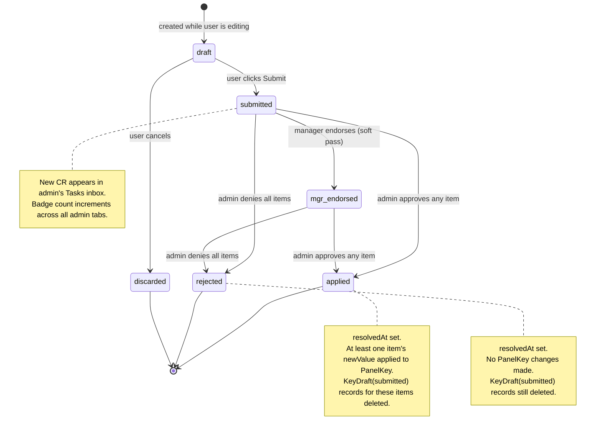
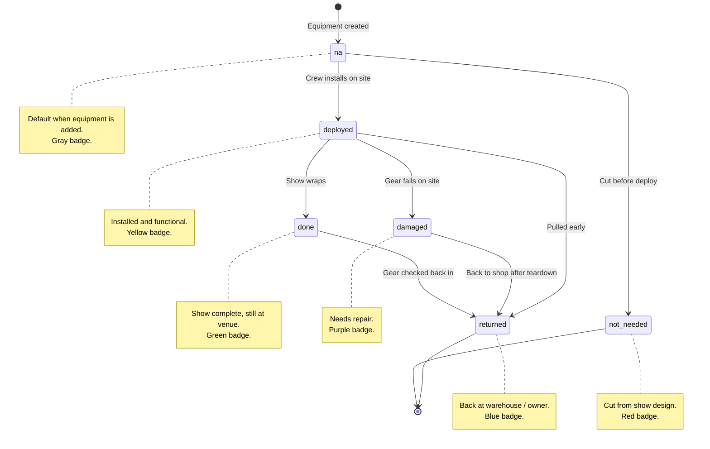
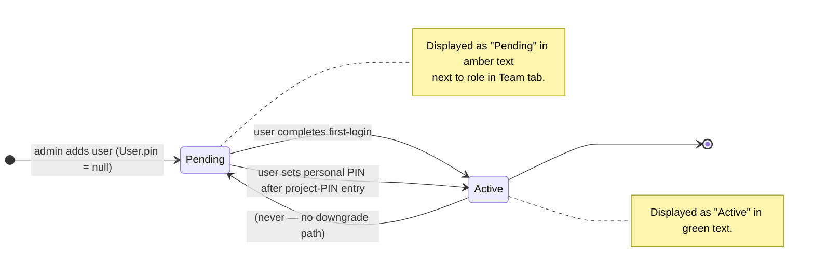
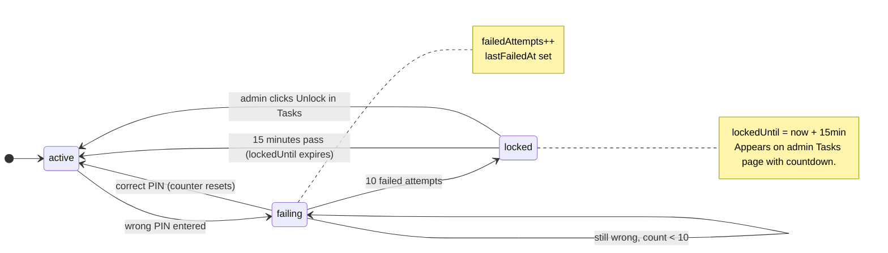

# Nodal Control — State Diagrams

**Updated:** 2026-04-17

Describes the state machines driving the app's key workflows: panel-key editing, change-request resolution, and equipment deploy status. The **Panel key** states below are the client-side visual states used in Panel Studio; the actual DB model is `PanelKey` + `KeyDraft`.

---

## 1. Panel Key (client-side visual state)

Each key on a panel has a single visual state in the UI. The state transitions are driven by user action + server fingerprint sync.

Note on denial: on the **crew's** client, when polling detects the denial (via `recentResolutions`), `initializeKeys` resets state to server truth (which is the pre-change value). The crew sees their previous assigned value come back + an error toast naming the denied keys.

---

## 2. ChangeRequest Lifecycle (server-side)

Status column values in `ChangeRequest.status`: `draft`, `submitted`, `mgr_endorsed`, `applied`, `rejected`, `discarded`. Schema also defines `approved` but the current `resolveChangeRequests` action skips straight to `applied` (no intermediate approved-waiting-to-apply state).

---

## 3. Equipment Deploy Status

Status values live in `src/lib/deploy-status.ts`. Transitions are not enforced by the server — any allowed role (admin, crew) can change to any value directly via the Listbox dropdown. This diagram is the **expected** operational flow.

---

## 4. User First-Login Status

Drives the Team-tab "Active / Pending" indicator. Not a stored enum — derived from `User.pin` being null or not.

---

## 5. Account Lockout

