# Nodal Control — Use Cases by Role

**Updated:** 2026-05-03

What each role can actually do in the current build. Roles are per-project (`ProjectMember.role`), but a user with `admin` on **any** project is promoted to "global admin" for the whole app.

---

## 1. Use case diagram

```mermaid
flowchart LR
    Admin((Admin / Global Admin))
    Manager((Manager))
    Crew((Crew))
    User((User))

    subgraph ProjectMgmt [Project Management]
        UC1[Create project]
        UC2[Archive project]
        UC3[Edit project details + return phase toggle]
        UC22[Browse any project - global admin only]
    end

    subgraph TeamMgmt [Team Management]
        UC4[Add team member]
        UC5[Edit member role]
        UC6[Remove member]
        UC7[Show Join QR / open Kiosk]
    end

    subgraph EquipmentMgmt [Equipment]
        UC8[Add equipment bulk]
        UC9[Assign equipment to member]
        UC10[Change deploy status]
        UC11[Edit equipment details + panel misc accessories]
    end

    subgraph PickListMgmt [Pick List]
        UC12[Add function single or bulk]
        UC13[Edit or rename function]
        UC14[Delete function]
    end

    subgraph PanelStudio [Panel Studio]
        UC15[Edit own keys directly - no approval]
        UC16[Submit key changes for approval]
        UC17[View own panel read-only]
        UC18[Review and resolve change requests]
        UC23[Browse mode - cycle users via dropdown / chevron]
        UC24[Panel-level Copy / Paste between users]
    end

    subgraph TasksPage [Tasks]
        UC19[Admin tasks: CR queue + lockouts]
        UC20[Approve or deny per key]
        UC21[Unlock locked user]
        UC25[Crew tasks: deploy + return queue]
    end

    Admin --> UC1
    Admin --> UC2
    Admin --> UC3
    Admin --> UC22
    Admin --> UC4
    Admin --> UC5
    Admin --> UC6
    Admin --> UC7
    Admin --> UC8
    Admin --> UC9
    Admin --> UC10
    Admin --> UC11
    Admin --> UC12
    Admin --> UC13
    Admin --> UC14
    Admin --> UC15
    Admin --> UC18
    Admin --> UC23
    Admin --> UC24
    Admin --> UC19
    Admin --> UC20
    Admin --> UC21

    Manager --> UC3
    Manager --> UC4
    Manager --> UC5
    Manager --> UC6
    Manager --> UC7
    Manager --> UC12
    Manager --> UC13
    Manager --> UC14
    Manager --> UC16
    Manager --> UC17
    Manager --> UC23
    Manager --> UC24

    Crew --> UC7
    Crew --> UC8
    Crew --> UC9
    Crew --> UC10
    Crew --> UC11
    Crew --> UC16
    Crew --> UC17
    Crew --> UC25

    User --> UC16
    User --> UC17
```

---

## 2. Permission matrix

Legend: ✅ can do · 👁 view only · ❌ cannot

| Action | Admin | Manager | Crew | User |
|---|---|---|---|---|
| **See every project (global)** | ✅ admin on any project = global | ❌ memberships only | ❌ | ❌ |
| View Projects list | ✅ all | ✅ own | ✅ own | ❌ |
| View Project detail | ✅ any | ✅ own | ✅ own | ❌ (proxy redirects to /my-equipment) |
| Create / rename / archive project | ✅ | ❌ | ❌ | ❌ |
| Edit project details + Return phase toggle | ✅ | ❌ | ❌ | ❌ |
| Edit Team tab | ✅ | ✅ | ❌ | ❌ |
| Edit Pick List | ✅ | ✅ | ❌ | ❌ |
| Edit Equipment | ✅ | ❌ | ✅ | ❌ |
| Change deploy status | ✅ | 👁 | ✅ | ❌ |
| Edit own Panel Studio | ✅ | ✅ | ✅ | ✅ |
| Edit someone else's panel | ✅ | ✅ | ❌ | ❌ |
| Save keys directly (no approval) | ✅ | ❌ | ❌ | ❌ |
| Submit keys via approval flow | N/A | ✅ | ✅ | ✅ |
| Review & approve change requests | ✅ | ❌ | ❌ | ❌ |
| Browse mode (project + user dropdowns on Panel Studio) | ✅ | ✅ | ❌ | ❌ |
| Panel-level Copy / Paste | ✅ | ✅ | ❌ | ❌ |
| Per-key Copy / Paste (Cmd-C / Cmd-V) | ✅ | ✅ | ✅ | ✅ |
| See Admin Tasks page (`/admin`) | ✅ | ❌ | ❌ | ❌ |
| See Crew Tasks page (`/tasks`) | ❌ | ❌ | ✅ | ❌ |
| Unlock a locked-out account | ✅ | ❌ | ❌ | ❌ |
| See Show QR / Kiosk button | ✅ | ✅ | ✅ | ❌ |
| See Add Member button | ✅ | ✅ | ❌ | ❌ |

### Note on global admin

`isGlobalAdmin` is computed in every page that needs it as `session.memberships.some((m) => m.role === 'admin')`. When true, the user gets:

- The unfiltered Projects list query (`src/app/projects/page.tsx`)
- Direct save (no change-request flow) on any panel they open (`isAdminGlobal` plumbed into `panel-studio.tsx`)
- The Tasks navbar item with the polled `/api/admin/task-count` badge

Removing the user's last admin membership demotes them back to whatever scoped roles remain.
