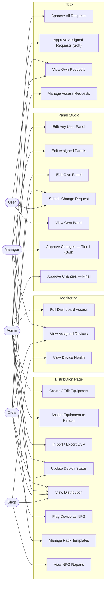

```mermaid
flowchart LR
    %% ===== ACTORS =====
    ADMIN(["Admin"])
    MGR(["Manager"])
    CREW(["Crew"])
    USR(["User"])
    SHOP(["Shop"])

    %% ===== DISTRIBUTION PAGE =====
    subgraph DIST["Distribution Page"]
        direction TB
        D1["Create / Edit Equipment"]
        D2["Assign Equipment to Person"]
        D3["Import / Export CSV"]
        D4["Update Deploy Status"]
        D5["View Distribution"]
        D6["Flag Device as NFG"]
        D7["Manage Rack Templates"]
        D8["View NFG Reports"]
    end

    %% ===== PANEL STUDIO =====
    subgraph PANEL["Panel Studio"]
        direction TB
        P1["Edit Any User Panel"]
        P2["Edit Assigned Panels"]
        P3["Edit Own Panel"]
        P4["Submit Change Request"]
        P5["View Own Panel"]
        P6["Approve Changes — Tier 1 (Soft)"]
        P7["Approve Changes — Final"]
    end

    %% ===== INBOX =====
    subgraph INB["Inbox"]
        direction TB
        I1["Approve All Requests"]
        I2["Approve Assigned Requests (Soft)"]
        I3["View Own Requests"]
        I4["Manage Access Requests"]
    end

    %% ===== MONITORING =====
    subgraph MON["Monitoring"]
        direction TB
        M1["Full Dashboard Access"]
        M2["View Assigned Devices"]
        M3["View Device Health"]
    end

    %% ===== ADMIN LINKS =====
    ADMIN --> D1
    ADMIN --> D2
    ADMIN --> D3
    ADMIN --> D4
    ADMIN --> D5
    ADMIN --> D7
    ADMIN --> P1
    ADMIN --> P7
    ADMIN --> I1
    ADMIN --> I4
    ADMIN --> M1

    %% ===== MANAGER LINKS =====
    MGR --> D5
    MGR --> P2
    MGR --> P6
    MGR --> I2
    MGR --> M2

    %% ===== CREW LINKS =====
    CREW --> D4
    CREW --> D5
    CREW --> D6
    CREW --> P3
    CREW --> P4
    CREW --> I3
    CREW --> M2

    %% ===== USER LINKS =====
    USR --> P5
    USR --> P4
    USR --> I3

    %% ===== SHOP LINKS =====
    SHOP --> D5
    SHOP --> D8
    SHOP --> M3
```
