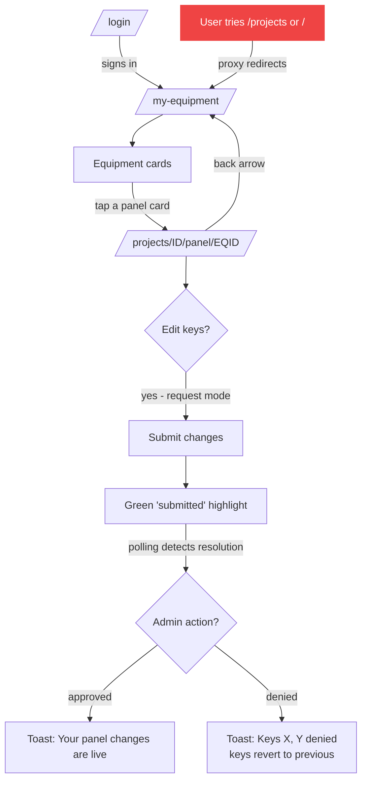
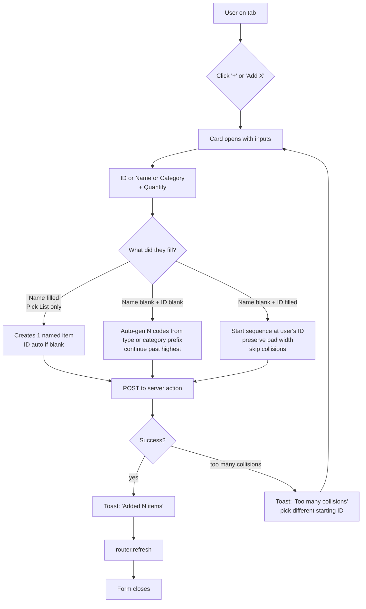
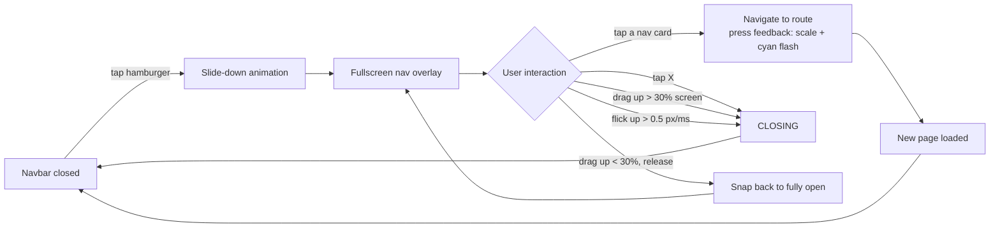
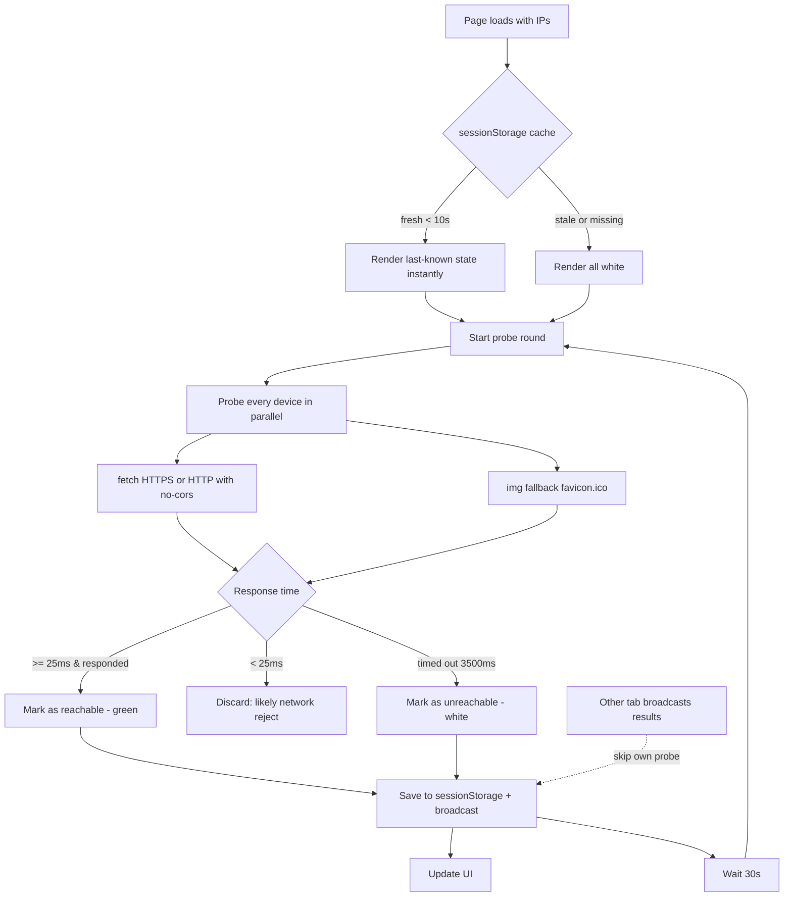

# Nodal Control — User Flow

**Updated:** 2026-05-03

End-user navigation and action flows for the current app. Each role starts at a different landing and unlocks different paths.

---

## 1. Top-level flow (entry + landing by role)

```mermaid
flowchart TD
    START([App opens]) --> COOKIE{Has session cookie?}
    COOKIE -->|no| LOGIN[/login/]
    COOKIE -->|yes| LANDING{Role check}

    LOGIN -->|enters name + personal PIN| AUTH{PIN valid?}
    LOGIN -->|taps Join Project| JOIN_PAGE[/login/join/]
    LOGIN -->|taps Forgot PIN| FORGOT[/login/forgot-pin/]

    AUTH -->|yes| LANDING
    AUTH -->|wrong, attempts < 10| LOGIN
    AUTH -->|10 wrong attempts| LOCKED[Account locked 15 min]
    LOCKED --> LOGIN

    LANDING -->|admin or manager or crew| DASH[/ Dashboard]
    LANDING -->|user-only memberships| MYEQ[/my-equipment/]

    JOIN_PAGE -->|scans QR or enters PIN + name| JOIN_FLOW
    JOIN_FLOW -->|new user| SET_PIN[Create personal PIN]
    JOIN_FLOW -->|existing user| LOGIN
    SET_PIN --> LOGIN

    classDef landing fill:#0178a3,stroke:#0178a3,color:#fff
    class DASH,MYEQ landing
```

---

## 2. Admin / Manager / Crew nav

```mermaid
flowchart LR
    DASH[Dashboard<br/>+ project switcher] --> NAV{Navbar}

    NAV --> TASKS[/admin or /tasks<br/>with polled badge]
    NAV --> PROJECTS[/projects/]
    NAV --> MYEQ_OPT[/my-equipment/]

    PROJECTS --> PLIST[Projects list<br/>admin: all · others: own]
    PLIST -->|click card| PDETAIL[/projects/ID/]

    PDETAIL --> TABS{Tabs}
    TABS --> EQ_TAB[Equipment]
    TABS --> TEAM_TAB[Team<br/>admin/manager]
    TABS --> PL_TAB[Pick List<br/>admin/manager]
    TABS --> PLOTS_TAB[Plots]
    TABS --> MYEQ_TAB[My Equipment<br/>crew only]

    EQ_TAB -->|click panel card| PS[/projects/ID/panel/EQID/]
    TEAM_TAB -->|click Show QR| QRCARD[QR card inline]
    PDETAIL -->|kiosk button| KIOSK[/projects/ID/kiosk/]

    MYEQ_OPT -->|admin/manager| BROWSE_REDIRECT[redirect to<br/>/projects/X/panel/Y?from=my-equipment]
    MYEQ_OPT -->|crew| MYEQ_CARDS[Equipment cards]
    MYEQ_CARDS -->|tap card| PS

    BROWSE_REDIRECT --> PS_BROWSE[Panel Studio<br/>browse mode]

    TASKS --> TASKS_LIST{Task cards}
    TASKS_LIST -->|admin| CR_CARD[Change request]
    TASKS_LIST -->|admin| LOCK_CARD[Lockout]
    TASKS_LIST -->|crew| DEPLOY_CARD[Deploy / Return]

    CR_CARD -->|click Review| PS_REVIEW[/projects/ID/panel/EQID/?review=MID/]
    LOCK_CARD -->|click Unlock| UNLOCK[Unlock user action]
```

---

## 3. User-only flow

User-only accounts (`isUserOnly` — every membership is role='user') bypass the proxy to only access two routes.



---

## 4. Admin / Manager browse loop (My Equipment → Panel Studio)

The unified My Equipment surface for anyone with `admin` or `manager` on any project. The cards-list page is skipped entirely — `/my-equipment` redirects directly into Panel Studio with `?from=my-equipment`.

```mermaid
flowchart TD
    ENTER[/my-equipment/] --> RESOLVE{Resolve project + member}
    RESOLVE -->|URL ?project= ?member=| PICK
    RESOLVE -->|cookie lastBrowseProject<br/>+ lastBrowseMember| PICK
    RESOLVE -->|fall back| FIRST[First admin/mgr project<br/>+ first member with gear]
    FIRST --> PICK
    PICK[Selected project + member] --> REDIR[server redirect to<br/>/projects/X/panel/Y?from=my-equipment]

    REDIR --> PS[Panel Studio in browse mode]

    PS --> HEADER[Browse Header<br/>Show ▼ · User ▼ · ◄ ►]
    PS --> SIBROW[Sibling-gear row<br/>only when user has multiple pieces]
    PS --> EDIT[Admin: Save direct<br/>Manager: Submit for approval<br/>Copy / Paste next to Save]

    HEADER -->|pick different show| SHOW_NEW[set lastBrowseProject cookie]
    HEADER -->|pick different user| USER_NEW[set lastBrowseMember cookie]
    HEADER -->|type-to-filter then Enter| FIRST_MATCH[First match selected]
    HEADER -->|◄ ►| ADJ[Prev / next user]

    SIBROW -->|click sibling card| SAME_USER_DIFF_GEAR[Same user, next piece<br/>still ?from=my-equipment]

    SHOW_NEW --> REDIR
    USER_NEW --> REDIR
    ADJ --> REDIR
    FIRST_MATCH --> REDIR
    SAME_USER_DIFF_GEAR --> PS

    EDIT --> NEXT{Done with this user?}
    NEXT -->|yes| HEADER
    NEXT -->|leave app| LATER[/my-equipment/ later]
    LATER -->|cookies hydrate| RESOLVE
```

Nav highlight: while `?from=my-equipment` is in the URL, the navbar marks **My Equipment** as current even though the path is `/projects/X/panel/Y`.

---

## 5. Change request — crew submits, admin resolves

The most important flow in the app. Diagram is from both sides.

```mermaid
flowchart TD
    subgraph CrewSide [Crew on their own Panel Studio]
        CS1[Panel Studio loaded] --> CS2[Tap empty or assigned key]
        CS2 --> PICKER[Picker opens]
        PICKER --> CS3{Pick an option}
        CS3 -->|Pick an item| CS4[Key state: 'changed' yellow]
        CS3 -->|Pick Unassigned| CS5[Key state: empty]
        CS3 -->|Cancel| CS1

        CS4 --> CS6[Click Submit changes]
        CS5 --> CS6
        CS6 --> CS7[Key state: 'submitted' green]
        CS7 --> CS8[Polling every 5s]

        CS8 -->|fingerprint unchanged| CS8
        CS8 -->|fingerprint changed| CS9{Any resolutions?}
        CS9 -->|approvals only| CS10[Toast: 'Your panel changes are live']
        CS9 -->|denials only| CS11[Toast: 'Keys X, Y denied']
        CS9 -->|mix| CS12[Both toasts fire]

        CS10 --> CS13[Reset to DB truth]
        CS11 --> CS13
        CS12 --> CS13
    end

    subgraph AdminSide [Admin in Tasks]
        AS1[/admin loaded] --> AS2[Tasks badge shows count]
        AS2 -->|click Tasks| AS3[Tasks list]
        AS3 --> AS4{Card type?}
        AS4 -->|change request| AS5[Click Review]
        AS4 -->|lockout| AS6[Click Unlock]

        AS5 --> AS7[/projects/ID/panel/EQID/?review=MID/]
        AS7 --> AS8[Per-key toggle: approve green or deny red]
        AS8 --> AS9[Click Resolve]
        AS9 --> AS10[resolveChangeRequests action]
        AS10 --> AS11[Applied items update PanelKey]
        AS10 --> AS12[CR.status = applied or rejected]
        AS10 --> AS13[router.replace /admin]
    end

    AS11 -.->|crew polling picks up| CS8
```

---

## 6. Panel Copy / Paste between users

Admin or manager (or any global admin) cloning a panel's keys onto another user.

```mermaid
flowchart LR
    SRC[Panel Studio<br/>source user PNL 3] --> COPY[Click Copy]
    COPY --> SS[(sessionStorage<br/>panel-clipboard)]
    COPY --> SYS[(System clipboard<br/>plain-text snapshot)]
    COPY --> TOAST1[Toast: Copied N keys]

    SS --> NEXT[Browse to next user<br/>via Browse Header dropdown]
    NEXT --> DEST[Panel Studio<br/>dest user PNL 4]

    DEST --> PASTE_BTN[Paste button visible<br/>since clipboard non-empty]
    PASTE_BTN --> PASTE[Click Paste]
    PASTE --> MATCH[Match each entry by<br/>keyIndex + page + expansion]
    MATCH --> OVERWRITE[Overwrite matching slots]
    OVERWRITE --> TOAST2[Toast: Pasted N keys<br/>from {sourceLabel}]
    OVERWRITE --> SAVE_OR_REQ{Edit mode}
    SAVE_OR_REQ -->|admin own/global| SAVE[Save direct]
    SAVE_OR_REQ -->|else| REQ[Submit as change request]
```

---

## 7. Pick List + Equipment add flows

Both follow the same pattern: an inline `<Card>` opens above the list with the input form, the user fills it, it posts to a server action, the list refreshes.



---

## 8. Mobile nav flow



---

## 9. Device reachability indicators

On pages showing equipment with IPs (Equipment tab, Panel Studio header), IP addresses are colored to show if the device is reachable on the current network.


