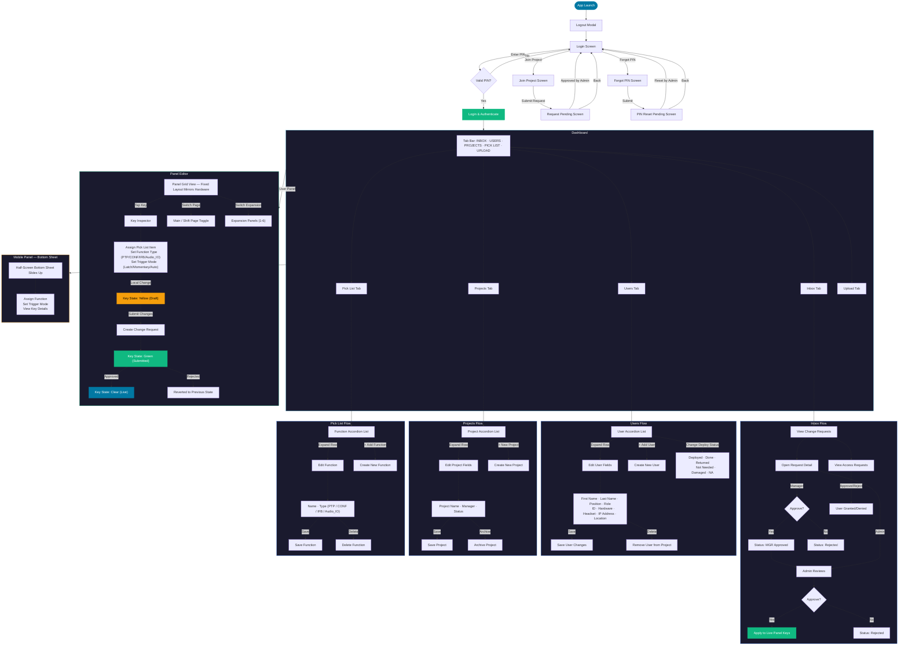

```mermaid
flowchart TD
    %% ===== AUTH FLOW =====
    START([App Launch]) --> LOGOUT_MODAL[Logout Modal]
    LOGOUT_MODAL --> LOGIN[Login Screen]
    
    LOGIN --> |Enter PIN| AUTH_CHECK{Valid PIN?}
    LOGIN --> |Join Project| JOIN[Join Project Screen]
    LOGIN --> |Forgot PIN| FORGOT[Forgot PIN Screen]
    
    AUTH_CHECK --> |Yes| CONNECT[Login & Authenticate]
    AUTH_CHECK --> |No| LOGIN
    
    JOIN --> |Submit Request| REQ_PENDING[Request Pending Screen]
    REQ_PENDING --> |Approved by Admin| LOGIN
    REQ_PENDING --> |Back| LOGIN
    
    FORGOT --> |Submit| PIN_PENDING[PIN Reset Pending Screen]
    PIN_PENDING --> |Reset by Admin| LOGIN
    PIN_PENDING --> |Back| LOGIN

    CONNECT --> DASHBOARD

    %% ===== DASHBOARD =====
    subgraph DASHBOARD[Dashboard]
        direction TB
        TABS[Tab Bar: INBOX · USERS · PROJECTS · PICK LIST · UPLOAD]
        
        TABS --> TAB_INBOX[Inbox Tab]
        TABS --> TAB_USERS[Users Tab]
        TABS --> TAB_PROJECTS[Projects Tab]
        TABS --> TAB_PICKLIST[Pick List Tab]
        TABS --> TAB_UPLOAD[Upload Tab]
    end

    %% ===== INBOX FLOW =====
    subgraph INBOX_FLOW[Inbox Flow]
        direction TB
        TAB_INBOX --> VIEW_REQUESTS[View Change Requests]
        VIEW_REQUESTS --> REQ_DETAIL[Open Request Detail]
        REQ_DETAIL --> |Manager| MGR_APPROVE{Approve?}
        MGR_APPROVE --> |Yes| MGR_APPROVED[Status: MGR Approved]
        MGR_APPROVE --> |No| MGR_REJECT[Status: Rejected]
        MGR_APPROVED --> ADMIN_REVIEW[Admin Reviews]
        REQ_DETAIL --> |Admin| ADMIN_REVIEW
        ADMIN_REVIEW --> ADMIN_APPROVE{Approve?}
        ADMIN_APPROVE --> |Yes| APPLY_CHANGES[Apply to Live Panel Keys]
        ADMIN_APPROVE --> |No| ADMIN_REJECT[Status: Rejected]
        VIEW_REQUESTS --> VIEW_ACCESS[View Access Requests]
        VIEW_ACCESS --> |Approve/Reject| ACCESS_RESOLVED[User Granted/Denied]
    end

    %% ===== USERS FLOW =====
    subgraph USERS_FLOW[Users Flow]
        direction TB
        TAB_USERS --> USER_LIST[User Accordion List]
        USER_LIST --> |Expand Row| EDIT_USER[Edit User Fields]
        EDIT_USER --> EDIT_FIELDS["First Name · Last Name · Position · Role
        ID · Hardware · Headset · IP Address · Location"]
        EDIT_FIELDS --> |Save| SAVE_USER[Save User Changes]
        EDIT_FIELDS --> |Delete| DELETE_USER[Remove User from Project]
        USER_LIST --> |+ Add User| ADD_USER[Create New User]
        USER_LIST --> |Change Deploy Status| DEPLOY_STATUS["Deployed · Done · Returned
        Not Needed · Damaged · NA"]
    end

    %% ===== PROJECTS FLOW =====
    subgraph PROJECTS_FLOW[Projects Flow]
        direction TB
        TAB_PROJECTS --> PROJECT_LIST[Project Accordion List]
        PROJECT_LIST --> |Expand Row| EDIT_PROJECT[Edit Project Fields]
        EDIT_PROJECT --> PROJ_FIELDS[Project Name · Manager · Status]
        PROJ_FIELDS --> |Save| SAVE_PROJECT[Save Project]
        PROJ_FIELDS --> |Archive| ARCHIVE_PROJECT[Archive Project]
        PROJECT_LIST --> |+ New Project| NEW_PROJECT[Create New Project]
    end

    %% ===== PICK LIST FLOW =====
    subgraph PICKLIST_FLOW[Pick List Flow]
        direction TB
        TAB_PICKLIST --> FUNC_LIST[Function Accordion List]
        FUNC_LIST --> |Expand Row| EDIT_FUNC[Edit Function]
        EDIT_FUNC --> FUNC_FIELDS["Name · Type (PTP / CONF / IFB / Audio_IO)"]
        FUNC_FIELDS --> |Save| SAVE_FUNC[Save Function]
        FUNC_FIELDS --> |Delete| DELETE_FUNC[Delete Function]
        FUNC_LIST --> |+ Add Function| ADD_FUNC[Create New Function]
    end

    %% ===== PANEL EDITOR FLOW =====
    DASHBOARD --> |Select User Panel| PANEL_EDITOR

    subgraph PANEL_EDITOR[Panel Editor]
        direction TB
        PANEL_VIEW[Panel Grid View — Fixed Layout Mirrors Hardware]
        PANEL_VIEW --> |Tap Key| KEY_INSPECT[Key Inspector]
        KEY_INSPECT --> ASSIGN["Assign Pick List Item
        Set Function Type (PTP/CONF/IFB/Audio_IO)
        Set Trigger Mode (Latch/Momentary/Auto)"]
        ASSIGN --> |Local Change| DRAFT["Key State: Yellow (Draft)"]
        DRAFT --> |Submit Changes| SUBMIT_CR[Create Change Request]
        SUBMIT_CR --> PENDING["Key State: Green (Submitted)"]
        PENDING --> |Approved| LIVE["Key State: Clear (Live)"]
        PENDING --> |Rejected| REVERTED[Reverted to Previous State]
        
        PANEL_VIEW --> |Switch Page| PAGE_SWITCH[Main / Shift Page Toggle]
        PANEL_VIEW --> |Switch Expansion| EXP_SWITCH["Expansion Panels (1-6)"]
    end

    %% ===== MOBILE PANEL FLOW =====
    DASHBOARD --> |Tap Key on Mobile| MOBILE_PANEL

    subgraph MOBILE_PANEL[Mobile Panel — Bottom Sheet]
        direction TB
        BOTTOM_SHEET[Half-Screen Bottom Sheet Slides Up]
        BOTTOM_SHEET --> MOBILE_ASSIGN["Assign Function
        Set Trigger Mode
        View Key Details"]
    end

    %% ===== STYLING =====
    style START fill:#0178a3,stroke:#0178a3,color:#fff
    style CONNECT fill:#10b981,stroke:#10b981,color:#fff
    style DASHBOARD fill:#1a1a2e,stroke:#0178a3,color:#fff
    style PANEL_EDITOR fill:#1a1a2e,stroke:#10b981,color:#fff
    style MOBILE_PANEL fill:#1a1a2e,stroke:#f59e0b,color:#fff
    style INBOX_FLOW fill:#1a1a2e,stroke:#3b82f6,color:#fff
    style USERS_FLOW fill:#1a1a2e,stroke:#3b82f6,color:#fff
    style PROJECTS_FLOW fill:#1a1a2e,stroke:#3b82f6,color:#fff
    style PICKLIST_FLOW fill:#1a1a2e,stroke:#3b82f6,color:#fff
    style DRAFT fill:#f59e0b,stroke:#f59e0b,color:#000
    style PENDING fill:#10b981,stroke:#10b981,color:#fff
    style LIVE fill:#0178a3,stroke:#0178a3,color:#fff
    style APPLY_CHANGES fill:#10b981,stroke:#10b981,color:#fff
```
