# Nodal Control — User Flow

**Updated:** 2026-06-08 (v2.6 — Frame Studio flow added)

End-user navigation and action flows for the current app. Each role starts at a different landing and unlocks different paths.

---

## 1. Top-level flow (entry + landing by role)

```mermaid
flowchart TD
    START([App opens]) --> COOKIE{Has session cookie?}
    COOKIE -->|no| LOGIN[/login/]
    COOKIE -->|yes| LANDING{Role check}

    LOGIN -->|enters name + personal PIN| AUTH{PIN valid?}
    LOGIN -->|taps Join Project| JOIN_PAGE[/login/join/]
    LOGIN -->|taps Forgot PIN| FORGOT[/login/forgot-pin/]

    AUTH -->|yes| LANDING
    AUTH -->|wrong, attempts < 10| LOGIN
    AUTH -->|10 wrong attempts| LOCKED[Account locked 15 min]
    LOCKED --> LOGIN

    LANDING -->|admin or manager or crew| DASH[/ Dashboard]
    LANDING -->|user-only memberships| MYEQ[/my-equipment/ → Panel Studio]

    DASH -.->|profile icon in header| PROFILE[/profile/]
    MYEQ -.->|profile icon in header| PROFILE

    JOIN_PAGE -->|scans QR or enters PIN + name| JOIN_FLOW
    JOIN_FLOW -->|new user| SET_PIN[Create personal PIN]
    JOIN_FLOW -->|existing user| LOGIN
    SET_PIN --> LOGIN

    classDef landing fill:#0178a3,stroke:#0178a3,color:#fff
    class DASH,MYEQ landing
```

---

## 2. Admin / Manager / Crew nav

```mermaid
flowchart LR
    DASH[Dashboard<br/>+ project switcher] --> NAV{Navbar}

    NAV --> TASKS[/admin or /tasks<br/>with polled badge]
    NAV --> PROJECTS[/projects/]
    NAV --> RADIOS[/radios/]
    NAV --> MYEQ_OPT[/my-equipment/]

    PROJECTS --> PLIST[Projects list<br/>admin: all · others: own]
    PLIST -->|click card| PDETAIL[/projects/ID/ "Comms"]

    PDETAIL --> HDR1{Header icons}
    HDR1 --> QR_BTN[QR icon → join QR modal]
    HDR1 --> KIOSK_BTN[Kiosk icon → /projects/ID/kiosk/]

    PDETAIL --> TABS{Tabs}
    TABS --> EQ_TAB[Equipment]
    TABS --> TEAM_TAB[Team<br/>admin/manager]
    TABS --> PL_TAB[Pick List<br/>admin/manager]
    TABS --> PLOTS_TAB[Plots]
    TABS --> RACKS_TAB[Racks v2.4<br/>RackTemplate list]
    TABS --> MYEQ_TAB[My Equipment<br/>crew only]

    EQ_TAB -->|click panel card| PS[/projects/ID/panel/EQID/]
    EQ_TAB -->|click switch ID e.g. SW 1<br/>NETGEAR M4250 models only| SWITCH_STUDIO[/projects/ID/switch/EQID/<br/>Switch Studio v2.5]
    SWITCH_STUDIO -->|Close button| EQ_TAB
    EQ_TAB -->|click frame ID e.g. FRM 1<br/>Riedel Artist models only| FRAME_STUDIO[/projects/ID/frame/EQID/<br/>Frame Studio v2.6]
    FRAME_STUDIO -->|Close button| EQ_TAB
    PL_TAB -->|tap location chip| LOC_RENAME[Rename location modal<br/>updates all rows in that loc]
    RACKS_TAB -->|click Edit on a rack| RACK_INLINE[Inline RackStudio<br/>?expand=rackId in URL]
    RACK_INLINE -->|eye icon| RACK_PREVIEW[/projects/ID/racks/RID/preview/<br/>operator-facing, both faces]
    RACK_PREVIEW -->|Close button| RACKS_TAB

    RADIOS --> RADHDR{Header icons}
    RADHDR --> RQR[QR icon → join QR modal]
    RADHDR --> RSCAN[Scanner icon → /radios/scan/]
    RADIOS --> RTABS{Tabs}
    RTABS --> R_EQ[Radio Equipment]
    RTABS --> R_CH[Radio Channels / Zones]
    R_EQ -->|status dropdown per radio| RSTATUS[na · out · returned<br/>damaged · lost]

    MYEQ_OPT --> BROWSE_REDIRECT[redirect to<br/>/projects/X/panel/Y?from=my-equipment]
    BROWSE_REDIRECT --> PS_BROWSE[Panel Studio<br/>browse mode]

    TASKS --> TASKS_LIST{Task cards}
    TASKS_LIST -->|admin| CR_CARD[Change request]
    TASKS_LIST -->|admin| LOCK_CARD[Lockout]
    TASKS_LIST -->|crew| DEPLOY_CARD[Deploy / Return]

    CR_CARD -->|click Review| PS_REVIEW[/projects/ID/panel/EQID/?review=MID/]
    LOCK_CARD -->|click Unlock| UNLOCK[Unlock user action]
```

The Comms (`/projects/[id]`) and Radios (`/radios`) pages both expose two
small icon buttons in the page header, to the left of the project
dropdown. The dropdown itself always claims half the viewport on mobile
(`w-[calc(50vw-1rem)]`), so the icon buttons sit outside that half-row.

| Page | Header icons (left → right) |
|---|---|
| Comms | QR (join QR modal) · Kiosk (open kiosk view) |
| Radios | QR (join QR modal) · Scanner (open `/radios/scan`) |

---

## 3. User-only flow

User-only accounts (`isUserOnly` — every membership is role='user') are
proxied straight from `/my-equipment` into Panel Studio. They cannot
reach `/`, `/projects`, `/radios`, or the admin/tasks queue, but they
*can* open `/profile` via the header avatar to manage their personal
PIN, name, and notification preferences.

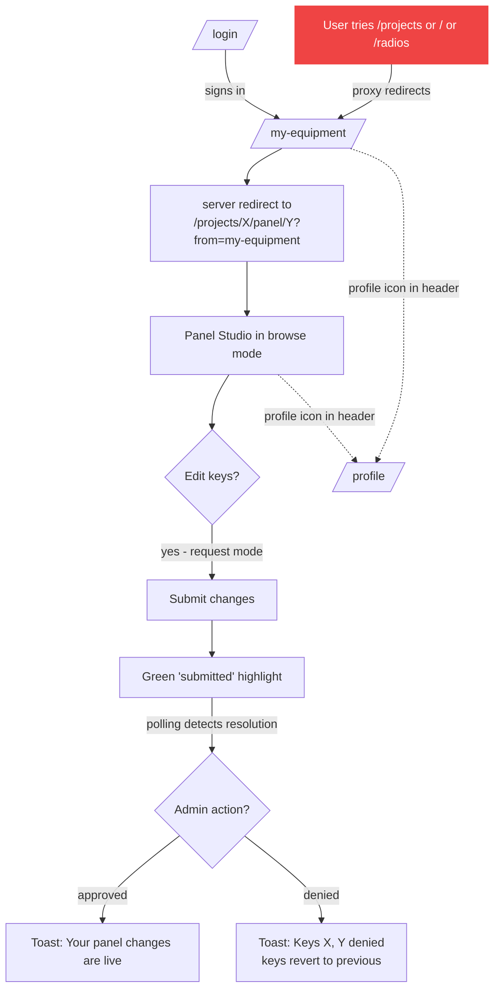

---

## 4. Browse loop (My Equipment → Panel Studio)

The unified My Equipment surface for *every* role — admin, manager,
crew, and user-only. The cards-list page is skipped entirely:
`/my-equipment` always redirects directly into Panel Studio with
`?from=my-equipment`. Cookies `lastBrowseProject` and `lastBrowseMember`
remember the last viewed combination so the next visit picks up where
the user left off.

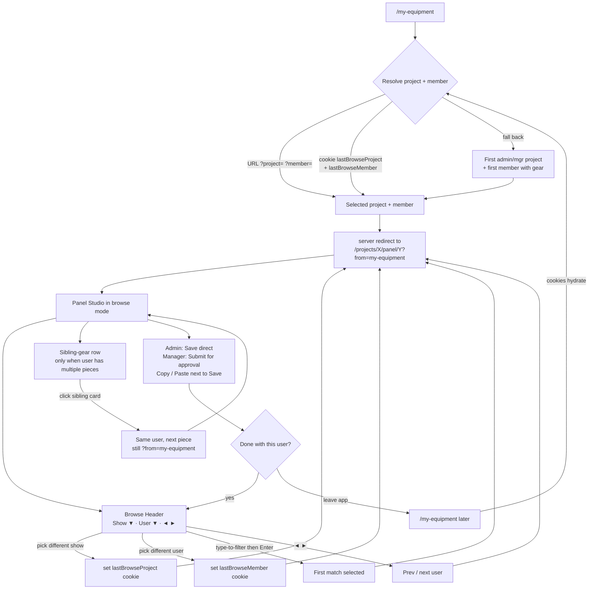

Nav highlight: while `?from=my-equipment` is in the URL, the navbar marks **My Equipment** as current even though the path is `/projects/X/panel/Y`.

---

## 5. Change request — crew submits, admin resolves

The most important flow in the app. Diagram is from both sides.

```mermaid
flowchart TD
    subgraph CrewSide [Crew on their own Panel Studio]
        CS1[Panel Studio loaded] --> CS2[Tap empty or assigned key]
        CS2 --> PICKER[Picker opens]
        PICKER --> CS3{Pick an option}
        CS3 -->|Pick an item| CS4[Key state: 'changed' yellow]
        CS3 -->|Pick Unassigned| CS5[Key state: empty]
        CS3 -->|Cancel| CS1

        CS4 --> CS6[Click Submit changes]
        CS5 --> CS6
        CS6 --> CS7[Key state: 'submitted' green]
        CS7 --> CS8[Polling every 5s]

        CS8 -->|fingerprint unchanged| CS8
        CS8 -->|fingerprint changed| CS9{Any resolutions?}
        CS9 -->|approvals only| CS10[Toast: 'Your panel changes are live']
        CS9 -->|denials only| CS11[Toast: 'Keys X, Y denied']
        CS9 -->|mix| CS12[Both toasts fire]

        CS10 --> CS13[Reset to DB truth]
        CS11 --> CS13
        CS12 --> CS13
    end

    subgraph AdminSide [Admin in Tasks]
        AS1[/admin loaded] --> AS2[Tasks badge shows count]
        AS2 -->|click Tasks| AS3[Tasks list]
        AS3 --> AS4{Card type?}
        AS4 -->|change request| AS5[Click Review]
        AS4 -->|lockout| AS6[Click Unlock]

        AS5 --> AS7[/projects/ID/panel/EQID/?review=MID/]
        AS7 --> AS8[Per-key toggle: approve green or deny red]
        AS8 --> AS9[Click Resolve]
        AS9 --> AS10[resolveChangeRequests action]
        AS10 --> AS11[Applied items update PanelKey]
        AS10 --> AS12[CR.status = applied or rejected]
        AS10 --> AS13[router.replace /admin]
    end

    AS11 -.->|crew polling picks up| CS8
```

---

## 6. Panel Copy / Paste between users

Admin or manager (or any global admin) cloning a panel's keys onto another user.

```mermaid
flowchart LR
    SRC[Panel Studio<br/>source user PNL 3] --> COPY[Click Copy]
    COPY --> SS[(sessionStorage<br/>panel-clipboard)]
    COPY --> SYS[(System clipboard<br/>plain-text snapshot)]
    COPY --> TOAST1[Toast: Copied N keys]

    SS --> NEXT[Browse to next user<br/>via Browse Header dropdown]
    NEXT --> DEST[Panel Studio<br/>dest user PNL 4]

    DEST --> PASTE_BTN[Paste button visible<br/>since clipboard non-empty]
    PASTE_BTN --> PASTE[Click Paste]
    PASTE --> MATCH[Match each entry by<br/>keyIndex + page + expansion]
    MATCH --> OVERWRITE[Overwrite matching slots]
    OVERWRITE --> TOAST2[Toast: Pasted N keys<br/>from {sourceLabel}]
    OVERWRITE --> SAVE_OR_REQ{Edit mode}
    SAVE_OR_REQ -->|admin own/global| SAVE[Save direct]
    SAVE_OR_REQ -->|else| REQ[Submit as change request]
```

---

## 7. Pick List + Equipment add flows

Both follow the same pattern: an inline `<Card>` opens above the list with the input form, the user fills it, it posts to a server action, the list refreshes.

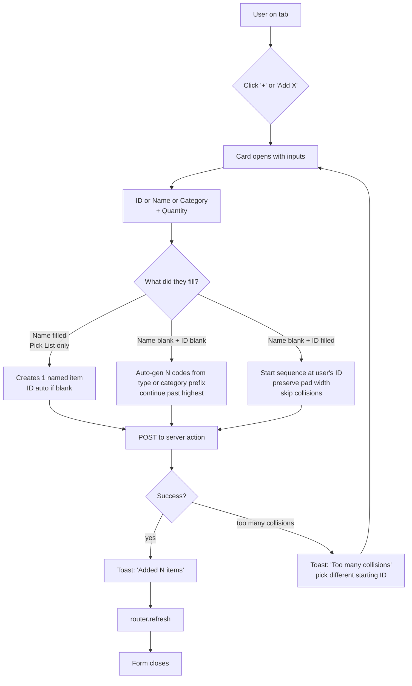

---

## 8. Mobile nav flow

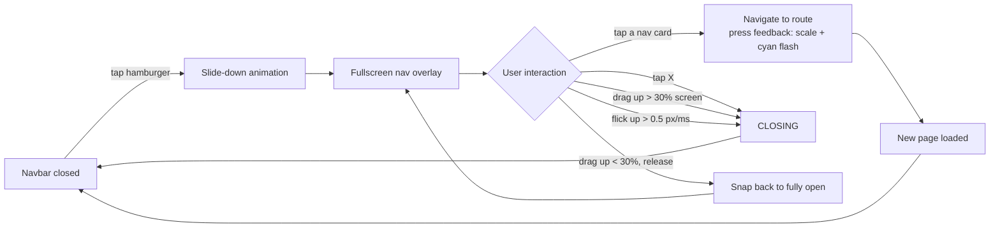

---

## 9. Device reachability indicators

On pages showing equipment with IPs (Equipment tab, Panel Studio header), IP addresses are colored to show if the device is reachable on the current network.

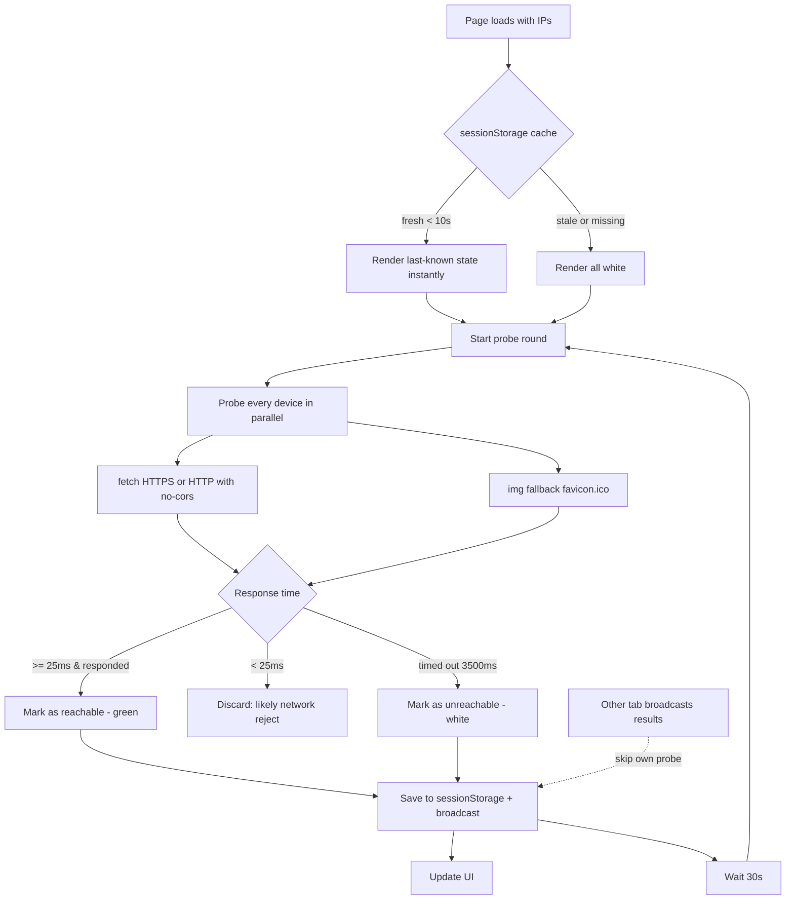

---

## 10. Radio barcode scan (admin / manager)

The Radios page header includes a scanner icon that opens
`/radios/scan`. The page asks for camera permission, runs a continuous
`@zxing/browser` decode loop, and branches based on whether the
scanned barcode matches a radio in the active project.

```mermaid
flowchart TD
    OPEN[Open /radios/scan] --> CAM{Camera permission?}
    CAM -->|denied| ERR[Show 'Camera blocked' message]
    CAM -->|granted| LOOP[ZXing continuous decode loop]

    LOOP --> SCAN[Barcode captured]
    SCAN --> LOOKUP{Match radio in project?}

    LOOKUP -->|no match| UNKNOWN[Open assignment modal<br/>pre-filled blank<br/>user enters ID, name, model]
    LOOKUP -->|status = out| AUTO[Silently call<br/>returnRadioByBarcode<br/>toast: 'Returned {id} from {member}']
    LOOKUP -->|status = na/returned<br/>damaged/lost| PROMPT[Open assignment modal<br/>pre-filled with radio fields<br/>assign to member + status]

    UNKNOWN --> SAVE_NEW[Create + assign Radio]
    PROMPT --> SAVE_EX[Update Radio assignment + status]
    AUTO --> COOLDOWN
    SAVE_NEW --> COOLDOWN[2s cooldown<br/>then resume LOOP]
    SAVE_EX --> COOLDOWN
    COOLDOWN --> LOOP
```

The cooldown prevents the same barcode from re-triggering immediately
while the modal closes. The modal itself uses the shared `Modal`
component with the optional `onClose` (top-right X) and the standard
Cancel · Save action row.

---

## 11. Pick List location rename

Each Pick-list row carries a free-form `location` string. Tapping the
location chip on the row opens a small rename modal; the new value is
applied to **every row in the project that shares the old location**,
not just the one tapped. This keeps zones / cases / road boxes
consistent without per-row edits.

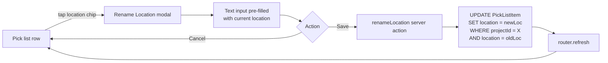

---

## 12. Rack Studio — design + edit a rack (v2.4)

The Racks tab under Comms lets ops design rack layouts before the
truck-pack. Each `RackTemplate` row in the list (name · location · RU ·
slot count) is collapsed by default. Tapping **Edit** expands the row
in place into the full RackStudio — all other rows are hidden so the
operator has a single-rack focus mode.

```mermaid
flowchart TD
    RACKS[Racks tab list] -->|+ Create rack| CREATE[Inline create form<br/>name + location + totalRU]
    RACKS -->|tap Edit on a row| EXPAND[Inline expansion<br/>sets ?expand=rackId in URL<br/>other rows hidden]

    EXPAND --> RS[RackStudio surface]
    RS --> RS_LEFT[Chassis<br/>vertical RU stack]
    RS --> RS_RIGHT[Device library<br/>right column desktop<br/>bottom sheet mobile]
    RS --> RS_TOP[Loose-gear tray<br/>chips above chassis]
    RS --> RS_HEADER[Header row<br/>name · location · RU<br/>+ eye icon + Close]

    RS_HEADER -->|tap name| META_FORM[Metadata edit form<br/>rename / relocate / resize]
    META_FORM -->|Save| RS
    META_FORM -->|Delete| CONFIRM[Modal: Delete rack?]
    CONFIRM -->|Confirm| GONE[Server delete<br/>collapse expansion<br/>refresh]

    RS_HEADER -->|eye icon| PREVIEW[/preview/ chrome-free]
    PREVIEW -->|X| EXPAND

    RS_HEADER -->|Close button| RACKS

    classDef url fill:#0178a3,stroke:#0178a3,color:#fff
    class EXPAND,PREVIEW url
```

### Three ways to place a slot

The RackStudio supports three flows for adding a device to a rack —
operators on different inputs (desktop trackpad, iPad touch, gloves on
a cart) gravitate toward different ones. All three end with the same
server POST to `/api/racks/[rackId]/slots`.

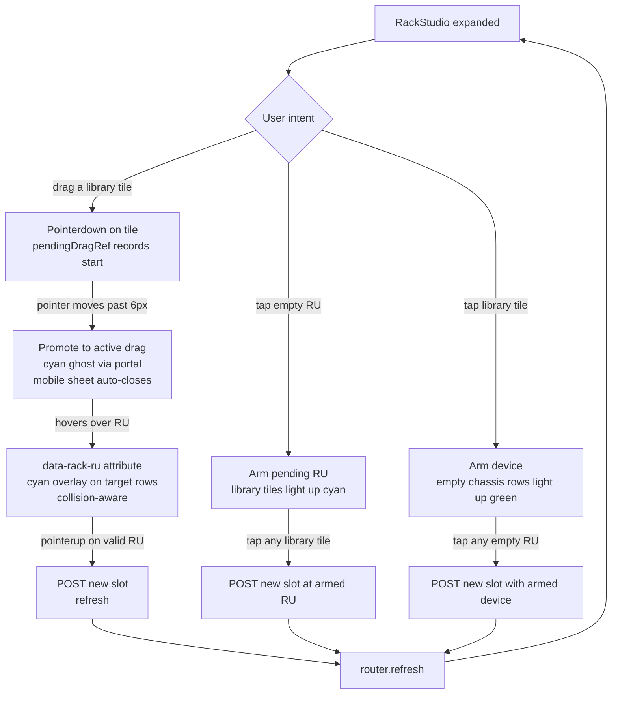

A tap (no movement past 6px) on a library tile is treated as the
"arm device" path — the same listener that promotes drags also clears
the pending ref on a fast pointerup. On mobile, the bottom-sheet
library auto-closes during the drag so the operator can see the
chassis, then reopens after drop (`sheetWasOpenBeforeDragRef`).

### Equipment-linked slots (switches + audio)

Slots can optionally link to a real `Equipment` row so deploy status,
location, model, and IP flow through. The page server-fetches
equipment in the `switches` and `audio` categories (panels are
excluded — they sit on desks, not in racks) and renders one tile per
unracked equipment row at the **top** of its category section in the
library.

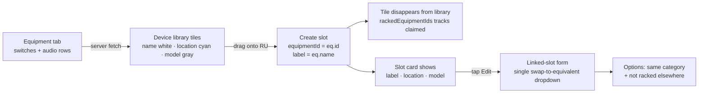

Unlinked slots (preset / custom-device-backed) show a different edit
form: a Device-type picker (filtered to non-equipment library items)
plus a freeform Label input. RU position and RU size are not editable
in either form — both are fixed at create time and resize happens via
drag.

### Loose gear tray

Devices with `ruSize === 0` (Antaira, Intellanet, TP Link, Netgate,
Bolero Antenna Master) get velcro'd inside the chassis or thrown in a
drawer — no RU slot. They render as chips in a wrap-flow row above
the chassis. Adding is tap-to-add (no drag). The × on a chip removes
**instantly** — no confirmation modal (PD-029). Re-adding from the
library is one tap if the operator changes their mind.

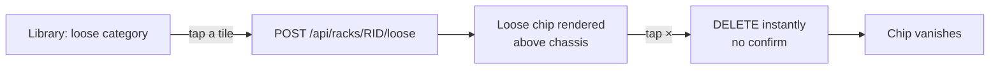

### Rack Preview (chrome-free)

The eye icon on an expanded rack row opens
`/projects/[id]/racks/[rackId]/preview` — a read-only single-rack
view with no navbar and no bottom-nav (same treatment as `/kiosk` and
`/zones`). Server pre-fetches both sides of slots so the side-toggle
costs zero round trips.

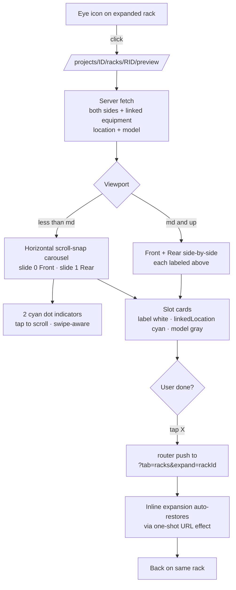

The URL → state restore is **one-shot on mount** (guarded by
`restoredFromUrlRef`); the `changeExpandedRack()` helper mirrors state
to the URL on every toggle. Together these prevent the "press Close
→ expansion re-opens 1-2 seconds later" bug that would otherwise
happen when a background data refresh re-fired the URL effect with a
stale `?expand=` still in the URL (PD-028).

---

## 13. Switch Studio — assign VLAN profiles to switch ports (v2.5)

Entry point lives on the Comms Equipment tab: the switch ID text
(`SW 1`, `SW 2`, …) on each NETGEAR M4250 card is a Link to
`/projects/[id]/switch/[equipmentId]`. Only switches whose
`hardwareType` resolves to a registered model (9P+1F, 26P+4F, 40P+4F,
24X8F8V, 16F) get a clickable ID — unmanaged switches (Antaira, TP
Link, Pliant Hub) don't have a VLAN config UI.

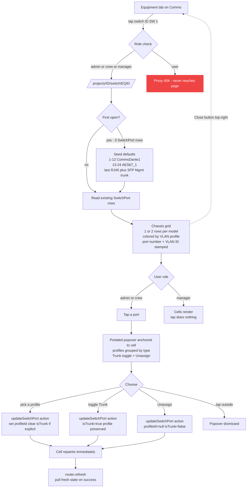

**Chassis grid layout:**
- 1 row: 9P+1F (10 ports linear) · 16F (16 SFP linear)
- 2 rows: 26P+4F (15×2) · 40P+4F (22×2) · 24X8F8V (20×2)
- Port number is small at the top of each cell; VLAN ID is the
  dominant value centered/lower
- Trunk ports always render gray (Management color) + small white
  "T" badge bottom-right, matching NETGEAR ProAV Engage

**Mobile UX:**
- Chassis wider than the viewport scrolls horizontally; chassis
  bezel uses `mx-auto w-fit` so it centers when it fits and anchors
  to the left edge when it doesn't (scroll reaches both ends, PD-031)
- Page header (`Comms` + ProjectSwitcher + bottom border) wraps in
  `AutoHideHeader` — slides up on scroll-down, same behavior as the
  rest of the app
- Identity strip below the header wraps into 2 rows on small screens
  (`SW 1 · model` + Close on row 1, `IP · port count` on row 2)
- IP renders as a cyan link → `http://<ip>` opens NETGEAR's web
  management UI in a new tab (`target="_blank"`)

**Server action gate:** `updateSwitchPort` re-checks role before any
write. Manager hitting the endpoint directly returns
`{ error: 'Read-only role' }`; user is already blocked at the
proxy.

---

## 14. Frame Studio — assign card types to Riedel Artist bays (v2.6)

Entry point lives on the Comms Equipment tab: the frame ID text
(`FRM 1`, `FRM 2`, …) on each Riedel Artist card is a Link to
`/projects/[id]/frame/[equipmentId]`. Only frames whose
`hardwareType` resolves to a registered model (`ARTIST_32`,
`ARTIST_MRF_64`, `ARTIST_MRF_128`, `ARTIST_1024`) get a clickable ID
— mirrors Switch Studio's policy.

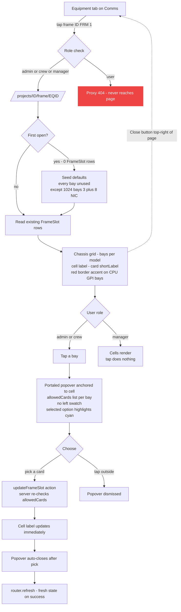

**Per-model bay layouts:**

| Model | Layout | Bay set |
|---|---|---|
| Artist 32 | 2-col × 3-row | Bay 1..4 (gray) + Bay A + Bay B (red) |
| Artist MRF 64 | 2-col × 5-row | Bay 1..8 (gray) + Bay A + Bay B (red) |
| Artist MFR 128 | 5-col × 4-row | Bay 1..16 (gray) + Bay A + Bay B + Bay X + Bay Y (red) |
| Artist 1024 | 5-col × 2-row (horizontal) | Bay 1, 2, 4, 5, 6, 7, 9, 10 (gray) + Bay 3, 8 (red, NIC bays) |

**Per-bay allowed cards:**

| Bay class | Allowed cards |
|---|---|
| Gray data bays (32 / 64 / 128) | `<unused>` / AIO / CAT5 / AES / COAX / VoIP / GPI / MADI / AVB |
| Bay A (every frame) | `<unused>` / CPU (S G2) / CPU (F G2) |
| Bay B (every frame) | `<unused>` / CPU (S G2) / CPU (F G2) / GPI |
| Bay X + Bay Y (MFR 128) | `<unused>` / GPI |
| Artist 1024 — bays 1/2/4/5/6/7/9/10 | `<unused>` / AES67 / DANTE / MADI |
| Artist 1024 — bays 3 + 8 | `<unused>` / NIC |

**Per-model card labels:** The older 32 / 64 / 128 use the long
Director naming (`AIO-108 G2` / `DANTE-108 G2` / etc.). The 1024
uses the short names (`AES67` / `DANTE` / `MADI` / `NIC`) per the
operator's Director terminology. `FrameModel.useShortCardLabels` on
the 1024 entry switches the picker to short labels for that model.

**Identity strip pair pattern (PD-038):**

```
FRM 1 · 17                                      [ Close ]
10.249.96.40 · 12 bays
```

`FRM N` white-bold + cyan-bold `Node ID` (the Riedel-programmed
hardware identifier). If a frame has no Node ID set, the cyan piece
omits cleanly.

**Equipment-card linkage:** Once a frame is created on the Equipment
tab, it automatically appears as a draggable tile in **Rack Studio's
Frames** section — operator drops it onto an RU and the slot lands
at the correct chassis height (`FrameModel.ruSize` shared with Rack
Studio: Artist 32 = 2U, MRF 64 = 3U, MFR 128 = 6U, Artist 1024 = 2U).
The slot card renders the frame's IP on its own row beneath the FRM
id + model.

**Server action gate:** `updateFrameSlot` re-checks role + validates
the picked card against the bay's `allowedCards` whitelist before any
write. A crafted request that tries to put a CPU card in a data bay
is rejected with `{ error: 'Card type not allowed in this bay' }`.
